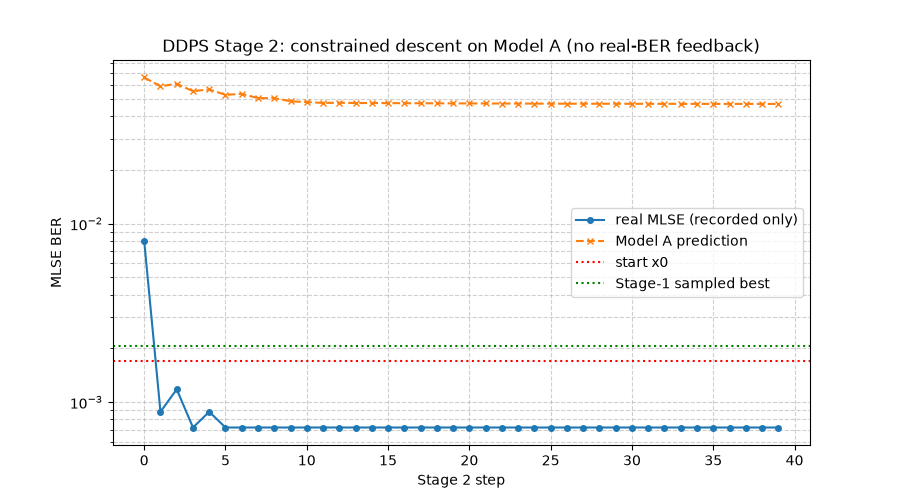
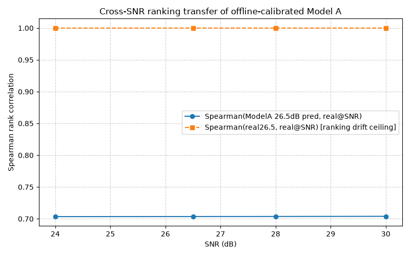

# DDPS 数据驱动物理代理优化器 — 结果报告

- **模式**：112G PAM4（56 GBd）
- **热身保真度**：SNR 26.5 dB / 65,536 Symbols（Stage 1 采样 + Stage 2 下降）
- **深水校验**：SNR 28.0 dB / 1,048,576 Symbols（DEEP_1E5）
- **实现**：100% 白盒（纯 Numpy，Ridge 闭式解 + 手写有限差分梯度下降，无 sklearn / scipy.optimize）

## Stage 2 下降过程（逐步可见，不回传真实 BER）



- 实线（圆点）为**真实 MLSE BER**（仅记录，不参与决策），虚线（叉号）为 Model A 预测。
- 红色虚线 = 起点 x0；绿色虚线 = Stage 1 采样最优。
- 可见：首步过冲 `7.99e-3` → 第 2 步 `8.82e-4` → 第 3 步命中 `7.20e-4` 后稳定收敛。

## 代理模型对比（同数据/同起点/同安全，仅换 Model A）

| 变体 | 收敛步 | 全程最大 MLSE | Spearman | DEEP_1E5 |
| --- | --- | --- | --- | --- |
| **Ridge + GD** | 3 | `7.99e-03` | `0.521` | `3.76e-05` |
| GPR(μ) + GD | 2 | `1.22e-03` | `0.378` | `3.76e-05` |
| GPR(μ+3σ) + GD | 2 | `1.39e-03` | `0.622` | `4.14e-05` |

## 关键指标（Ridge + GD，推荐）

| 指标 | 数值 |
| --- | --- |
| 起点 x0 真实 MLSE | `1.69e-03` |
| Stage 1 采样最优 MLSE | `2.05e-03` |
| **Stage 2 最优 MLSE（不回传，第 3 步）** | **`7.20e-04`** |
| Stage 2 最大 MLSE（安全上限） | `7.99e-03` |
| 最优 Taps | `[-0.0022, -0.0026, -0.0078, -0.2618, 0.6714, 0.0026, 0.0488, -0.0011, -0.0017]` |
| 最优 CTLE DC | `0.000 dB` |

## 深水校验 (DEEP_1E5)

```
start x0  @DEEP_1E5: 1.44e-03
DDPS best @DEEP_1E5 (9D): 3.76e-05
SHC ref   @DEEP_1E5 (9D): 3.76e-05
SHC ref   @DEEP_1E5 (12D fp2=0.9): 3.76e-05
```

## 跨 SNR 排序迁移（离线标定的 Model A 能否跨链路条件用）



| SNR | Spearman(ModelA 预测, 真实) | Spearman(真实@26.5, 真实@SNR) |
| --- | --- | --- |
| 24.0 dB | `0.703` | `1.000` |
| 26.5 dB | `0.704` | `1.000` |
| 28.0 dB | `0.704` | `1.000` |
| 30.0 dB | `0.704` | `1.000` |

**结论**：真实排序跨 SNR 完全不变（Spearman=1.0），Model A 排序精度 ≈0.70 且与 SNR 无关 → **无需分桶**，
只需对绝对值做单调/分位数校准；0.70 的排序精度是 7-tap FIR 特征的表达能力上限，与 SNR 无关。
