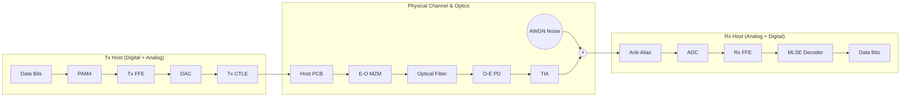

# 01. DSP 架构与参数说明

[🔙 返回主页](../README.md)

本项目是一个纯白盒实现的 112G/224G PAM4 LPO (Linear Pluggable Optics) 通信链路仿真平台。它主要由三个模块构成：发送端 (Tx DSP)、信道模型 (Channel) 和接收端 (Rx DSP)。所有参数均通过根目录下的 `config.xlsx` 进行管理和下发（也可在运行时动态覆盖）。

---

## 1. 核心架构说明

### 1.1 发送端 (Tx DSP & Analog Front-End)
由于 LPO (Linear Pluggable Optics) 模块内部不包含 DSP，所有的发送端均衡均由 Host ASIC 完成。
- **纯线性 FFE**：使用 FIR 结构的 Tx FFE 预加重，对抗信道高频衰减。
- **Tx CTLE (模拟域)**：为了模拟 Host 端 SerDes 芯片的连续时间预加重能力，系统在通过 DAC (Zero-Order Hold) 后，紧接着在**模拟域信道的最前端（即 Tx 端）**部署了 IEEE COM 标准的 CTLE 均衡器，防止由于位置靠后而带来的接收端 TIA 噪声放大。

### 1.2 信道模型 (Channel)
- **多采样率仿真**：DSP 核心以 2 Sps 运行，信道（包括 MZM、光纤色散、探测器、TIA）中信号上采至 8 Sps。
- **物理信道特性**：包含了 Host PCB Trace 频响滤波、光模块内部 MZM/PD 的电光转换带宽限制，以及长距 Fiber 引入的插损。

### 1.3 接收端 (Rx DSP)
- **数字 FFE (T/2 Spaced)**：Host ASIC 接收端使用分数间隔 (Fractional-Spaced) FFE 均衡器。通过内置的 LMS (最小均方差) 算法进行自适应抽头寻优。
- **完全解耦的 DFE**：由于误差传播在极高误码率下会导致系统雪崩，且与 MLSE 相关记忆提取产生冲突，系统默认关闭 DFE (`dfe_taps = 0`)。
- **常态开启的高阶 MLSE**：内置了基于 Viterbi 算法的 MLSE。系统默认开启（`mlse_memory = 1`），使用 Burg 算法自回归拟合残余色噪，联合信道记忆来突破线性 FFE 的理论物理极限。

### 1.4 全链路数据流框图

> [!TIP]
> 上图仅展示了数据链路的流向。关于**整个系统的优化架构循环框图**（即不同优化器如何生成权重、与跑流仿真配合并根据 MLSE BER 决策下一步），请参阅：👉 [04. 优化算法架构与原理解析 (Optimization Algorithms)](04_Optimization_Algorithms.md#1-优化架构与系统配合框图)。

---

## 2. `config.xlsx` 关键参数字典

### [System] 全局配置
- `baud_rate`: 112.5e9 (即 112.5 GBd，对应 224G PAM4)。
- `sps_dsp` / `sps_channel`: DSP 与模拟信道的采样率（通常为 2 和 8）。
- `snr_db`: 加性白高斯噪声 (AWGN) 的信噪比设定，默认 `25 dB`。
- `plot_intermediate_eyes`: `True`/`False`。控制是否绘制中间各个物理节点的 50Sps 高清平滑眼图，输出至 `result/`。

### [Tx] 发送端配置
- `ffe_taps`: Tx FFE 总抽头数。
- `ffe_pre`: Tx FFE 前向（Pre-cursor）抽头数，决定了中心主抽头的位置。
- `custom_taps`: 手动指定的固定抽头数组。
- `optimize_mode`: 优化器模式开关。
  - `'FFE_ONLY'`：仅优化 8 个 Tx FFE 前后抽头与 1 个 CTLE DC Gain（9维空间）。
  - `'JOINT'`：联合优化 8 个 Tx FFE 抽头与 CTLE 的 4 个完整物理参数（DC Gain, fz, fp1, fp2），即 **12维** 白盒全局寻优。

### [Rx] 接收端配置
- `ffe_taps` / `ffe_pre`: Rx FFE 的总抽头与前向抽头数配置。
- `dfe_taps`: DFE 抽头数（设为 0 即为纯线性均衡）。
- `train_len`: LMS 训练序列长度（目前前 2000 个符号用于训练，之后冻结抽头以防误码传播）。
- `lms_mu`: 训练步长。
- `mlse_memory`: 维特比算法的记忆深度。

---

[🔙 返回主页](../README.md)
