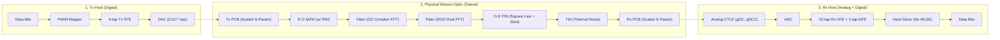

# 01. DSP 架构与物理参数详解

[🔙 返回主页](../README.md)

本项目是一个纯白盒实现的 112G/224G/448G PAM4 LPO (Linear Pluggable Optics) 通信链路仿真平台。它主要由三个模块构成：发送端 (Tx DSP)、物理光电信道 (Channel) 和接收端 (Rx DSP)。所有参数均通过根目录下的 `config.xlsx` 进行管理和下发。

---

## 1. 核心架构说明

### 1.1 发送端 (Tx DSP)
由于 LPO 模块内部不包含重型 DSP，所有的发送端均衡均由 Host ASIC 完成。
- **纯线性 FFE**：使用 9-tap T-spaced 的 Tx FFE 进行预加重，对抗信道高频衰减。在我们的优化架构中，Tx FFE 的抽头系数是我们核心优化的对象。

### 1.2 微观物理光电信道 (Physical Channel)
- **多采样率仿真**：DSP 核心以 2 Sps (Symbol per second) 运行，信道（包括 MZM、光纤色散、探测器、TIA）中信号上采至 8 Sps，进行极其精细的模拟域仿真。
- **动态插损匹配**：对给定的 IEEE/OIF S4P 模型进行自动频域缩放 (Frequency Scaling)，精准匹配用户配置的奈奎斯特频率插损 (如 10dB, 12dB)。
- **SJTU 级微观器件建模**：
  - **MZM (马赫-曾德尔调制器)**：严格构建了包含消光比（ER=25dB）和 $V_{bias}$ 的双臂干涉指数复数模型。Tx 驱动摆幅控制在 $0.617V$ 确保工作在线性区。
  - **分布物理噪声**：彻底抛弃全局信噪比 (SNR_dB)，全链路噪声由微观公式驱动：
    - **RIN 噪声**：激光器内部发出的光强波动 ($-150$ dB/Hz)。
    - **Thermal / Shot 噪声**：PIN 的平方律散粒噪声与 TIA 等效输入热噪声 ($16$ pA/$\sqrt{Hz}$)。
  - **光纤频散解耦**：色散 (CD) 严格作用于复数光场，而偏振态分裂带来的差分群延迟 (DGD) 直接作用于检波后的实数光功率。

### 1.3 接收端 (Rx DSP & 均衡)
- **模拟均衡 (Rx Analog CTLE)**：双级连续时间线性均衡器（CTLE），带有 `gDC` 和 `gDC2` 两个独立可调参数，这是我们在 Tx 之外的额外优化自由度（构成 10 维寻优空间）。
- **数字均衡 (Rx FFE/DFE)**：Host ASIC 接收端使用长达 22-tap 的 T-spaced FFE 和 1-tap DFE。通过内置的 LMS (最小均方差) 算法，针对接收到的受损信号进行盲搜抽头收敛。为了抵抗巨大的物理噪声，系统的 AGC (自动增益控制) 全部采用 RMS 均方根功率度量，以稳定 LMS 步长。
- **无 MLSE 的纯切片判决 (Pure Slicer)**：为了模拟最严苛、延迟最低的 LPO 场景，**当前代码中的维特比 MLSE 内存被设为了 0 (`mlse_memory = 0`)**。这意味着系统在 Rx 均衡后直接退化为简单的无记忆 4 电平切片器 (Slicer)。测试报表中的 `MLSE BER` 即指代此切片器的真实硬判决误码率。

### 1.4 全链路数据流框图

```mermaid
%%{init: {'themeVariables': { 'background': 'transparent'}}}%%
graph LR
    subgraph R1 ["1. Tx Host (Digital)"]
        direction TB
        A[Data Bits] --> B[PAM4 Mapper]
        B --> C["9-tap Tx FFE"]
        C --> D["DAC (0.617 Vpp)"]
    end

    subgraph R2 ["2. Physical Electro-Optic Channel"]
        direction TB
        F["Tx PCB (Scaled S-Param)"] --> G["E-O MZM (w/ RIN)"]
        G --> H["Fiber (CD Complex FFT)"]
        H --> I["Fiber (DGD Real FFT)"]
        I --> J["O-E PIN (Square Law + Shot)"]
        J --> K["TIA (Thermal Noise)"]
        K --> L["Rx PCB (Scaled S-Param)"]
    end

    subgraph R3 ["3. Rx Host (Analog + Digital)"]
        direction TB
        M["Analog CTLE (gDC, gDC2)"] --> N["ADC"]
        N --> O["22-tap Rx FFE + 1-tap DFE"]
        O --> P["Hard Slicer (No MLSE)"]
        P --> Q[Data Bits]
    end
    
    D -.-> F
    L -.-> M
```

---

## 2. `config.xlsx` 关键参数字典

### [System] 全局配置
- `target_case`: 设定目标应力用例。脚本会根据该标识符去 `stress_cases` 寻找并加载物理环境配置。
- `baud_rate`: 波特率设定。`112G` (56GBd), `224G` (112.5GBd), `448G` (212.5GBd)。
- `sps_dsp` / `sps_channel`: DSP 与模拟信道的采样率（通常为 2 和 8）。

### [Stress Cases] 物理损伤应力配置
`stress_cases` 是一个独立的二维表，每一行代表一个特定的物理应力环境，不设任何“全局 SNR”，全部由真实物理器件参数驱动：
- `tx_pcb_loss_nyquist_db` / `rx_pcb_loss_nyquist_db`: 在 Nyquist 频率下的目标信道电插损 (如 7.0dB 或 10.0dB)。
- `cd_ps_nm`: 色散 (CD) 容限。
- `dgd_ps`: 差分群时延 (DGD) 容限。
- `laser_rin_db_hz`: 激光器相对强度噪声 (如 -150 dB/Hz)。
- `mzm_er_db`: 调制器消光比 (如 25 dB)。
- `tia_noise_pa_rthz`: TIA 等效输入热噪声 (如 16.0 pA/$\sqrt{Hz}$)。

### [Tx / Rx] 均衡与算法配置
- `ffe_taps` / `ffe_pre`: FFE 总抽头数与前向抽头数。Tx 固定为 9，Rx 固定为 22。
- `dfe_taps`: 默认 1-tap。
- `lms_mu`: Rx LMS 训练步长（如 1e-4）。
- `mlse_memory`: 默认 0，系统全退化为纯线性/DFE均衡后的简单门限切片。

---

[🔙 返回主页](../README.md)
