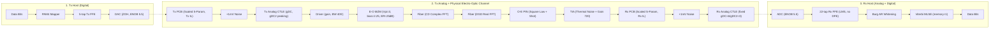

# 01. DSP 架构与物理参数详解

[🔙 返回主页](../README.md)

本项目是一个纯白盒实现的 112G/224G/448G PAM4 LPO (Linear Pluggable Optics) 通信链路仿真平台。它主要由三个模块构成：发送端 (Tx DSP)、物理光电信道 (Channel) 和接收端 (Rx DSP)。所有参数均通过根目录下的 `config.xlsx` 进行管理和下发。

---

## 1. 核心架构说明

### 1.1 发送端 (Tx DSP)
由于 LPO 模块内部不包含重型 DSP，所有的发送端均衡均由 Host ASIC 完成。
- **纯线性 FFE**：使用 5-tap T-spaced 的 Tx FFE 进行预加重，对抗信道高频衰减。4 个旁瓣为自由变量，主抽头由归一化派生（1 - Σ|旁瓣|）。FFE 抽头系数是 DDPS 梯度下降寻优的核心对象。

### 1.2 微观物理光电信道 (Physical Channel)
- **多采样率仿真**：DSP 核心以 2 Sps (Symbol per second) 运行，信道（包括 MZM、光纤色散、探测器、TIA）中信号上采至 8 Sps，进行极其精细的模拟域仿真。
- **动态插损匹配**：对给定的 IEEE/OIF S4P 模型进行自动频域缩放 (Frequency Scaling)，精准匹配用户配置的奈奎斯特频率插损 (默认 10dB，最差 20dB)。
- **SJTU 级微观器件建模**：
  - **MZM (马赫-曾德尔调制器)**：严格构建了包含消光比（ER=25dB）和 $V_{bias}=2.25$ 的双臂干涉指数复数模型。$V_\pi=3$。
  - **分布物理噪声**：彻底抛弃全局信噪比 (SNR_dB)，全链路噪声由微观公式驱动：
    - **RIN 噪声**：激光器内部发出的光强波动 ($-150$ dB/Hz)。
    - **Thermal / Shot 噪声**：PIN 的平方律散粒噪声与 TIA 等效输入热噪声 ($16$ pA/$\sqrt{Hz}$)。
    - **+1mV 前端噪声**：DAC 输出后注入 1mV 高斯噪声。
  - **光纤频散解耦**：色散 (CD) 严格作用于复数光场，而偏振态分裂带来的差分群延迟 (DGD) 直接作用于检波后的实数光功率。

### 1.3 接收端 (Rx DSP & 均衡)
- **发送端模拟均衡 (Tx Analog CTLE)**：OIF 2Z3P 高频 peaking 拓扑，`gDC`（高频 peaking gain，直流增益恒 0 dB）与 `gDC2`（低频 shelf gain）两个独立维度在代码与配置中隶属 **[tx] 表**，物理上位于 **Tx 电插损（PCB/S4P）之后、Driver 之前**。链路顺序为
  `DAC(ZOH,ENOB 5.5) → Tx 电插损(S4P) → +1mV 噪声 → Tx 模拟 CTLE(gDC,gDC2 peaking) → Driver(gain) → Driver 带限(40GHz) → MZM(Vπ=3,bias=2.25,ER=25dB) → 光纤 → PIN → TIA → Rx 电插损(S4P) → +1mV 噪声 → Rx 模拟 CTLE(固定 gDC=6/gDC2=3) → ADC → Rx FFE → MLSE`。
  **Tx driver 路径无 VGA、无 RMS 归一化**（gain 是链路最后一个不被下游吸收的线性乘子，故可作独立搜索维）；**Rx 侧只有 TIA 一层物理 AGC**（RMS 归一化到归一化 PAM4 的参考 √5/3 ≈ 0.7454 V，见 `channel_imdd.py`），ADC 数字域不再有第二层 AGC。
- **接收端模拟均衡 (Rx Analog CTLE)**：与 Tx CTLE 同一 peaking 拓扑，但参数**固定**（`gDC=6 dB, gDC2=3 dB`，SJTU standard），位于 Rx 电插损之后、ADC 之前，作为静态均衡基座，**不参与寻优**。
- **Driver 增益 (`driver_gain`)**：Driver 的**真实线性电压增益**，标定值 DRIVER_GAIN_NOMINAL=1.0197。gain 是 DDPS 的**第 7 个搜索维**（`u_gain = log10(gain / 1.0197)`），经 drive_rms 进入代理模型输入，参数箱信任域 ±0.30 dex；每用例最优 gain 倍率由 per-case target_rms 扫描标定作为参照（`gain = gain_scan × (target_rms / rms_measured)`）。数字域 PAM4 归一化 ±1（电平 [-1,-1/3,1/3,1]），driver 增益是把 ±1 DAC 输出放大到 MZM 驱动摆幅的桥梁。
- 因此 DDPS 寻优空间为 **7 维**：4 个 FFE 旁瓣 + gDC + gDC2 + u_gain。
- **数字均衡 (Rx FFE)**：Host ASIC 接收端使用 22-tap T-spaced Rx FFE，内置 LMS 自适应收敛（DFE 默认 `dfe_taps=0` 全关，防高误码雪崩）。
- **MLSE (默认开启, memory=1)**：Rx FFE 之后送入 **Viterbi MLSE（memory=1，4 状态）+ Burg AR 白化** 联合解码。当前配置 `mlse_memory = 1`，因此**全平台所有误码率报告统一为 `BER_MLSE`**（该 MLSE 判决输出的 Gray 映射 BER）。一旦开启 MLSE，系统自动锁死 DFE（见 `main.py`），避免 DFE 吃掉 MLSE 所需的残余 ISI。
- **真逐位 Gray BER**：BER 用 `g = s ^ (s >> 1)` 逐位 Gray 映射、逐位比较（`位错误数 / 总位数`），不再用 SER/2 近似；0 错误伪计数 = 0.5/(2N) 位。

### 1.4 全链路数据流框图

```mermaid
%%{init: {'themeVariables': { 'background': 'transparent'}}}%%
graph LR
    subgraph R1 ["1. Tx Host (Digital)"]
        direction TB
        A[Data Bits] --> B[PAM4 Mapper]
        B --> C["5-tap Tx FFE"]
        C --> D["DAC (ZOH, ENOB 5.5)"]
    end

    subgraph R2 ["2. Tx Analog + Physical Electro-Optic Channel"]
        direction TB
        E["Tx PCB (Scaled S-Param, Tx IL)"] --> E2["+1mV Noise"]
        E2 --> F["Tx Analog CTLE (gDC, gDC2 peaking)"]
        F --> G1["Driver (gain, BW 40G)"]
        G1 --> G["E-O MZM (Vpi=3, bias=2.25, ER=25dB)"]
        G --> H["Fiber (CD Complex FFT)"]
        H --> I["Fiber (DGD Real FFT)"]
        I --> J["O-E PIN (Square Law + Shot)"]
        J --> K["TIA (Thermal Noise + Gain 720)"]
        K --> L["Rx PCB (Scaled S-Param, Rx IL)"]
        L --> L2["+1mV Noise"]
        L2 --> L3["Rx Analog CTLE (fixed gDC=6/gDC2=3)"]
    end

    subgraph R3 ["3. Rx Host (Analog + Digital)"]
        direction TB
        M["ADC (ENOB 5.5)"] --> N["22-tap Rx FFE (LMS, no DFE)"]
        N --> O["Burg AR Whitening"]
        O --> P["Viterbi MLSE (memory=1)"]
        P --> Q[Data Bits]
    end

    D -.-> E
    L3 -.-> M
```

---

## 2. `config.xlsx` 关键参数字典

### [System] 全局配置
- `target_case`: 设定目标应力用例。脚本会根据该标识符去 `stress_cases` 寻找并加载物理环境配置。
- `baud_rate`: 波特率设定。`112G` (56GBd), `224G` (112.5GBd), `448G` (212.5GBd)。
- `sps_dsp` / `sps_channel`: DSP 与模拟信道的采样率（通常为 2 和 8）。

### [Stress Cases] 物理损伤应力配置
`stress_cases` 是一个独立的二维表，每一行代表一个特定的物理应力环境，不设任何"全局 SNR"，全部由真实物理器件参数驱动：
- `tx_pcb_loss_nyquist_db` / `rx_pcb_loss_nyquist_db`: 在 Nyquist 频率下的目标信道电插损，**Tx / Rx 可独立配置**（默认 10.0 dB，最差 20.0 dB，对齐 LPO MSA 7.2.1 die-to-die 上限）。
- `driver_gain`: Driver **真实线性电压增益**（标定值 1.0197）。DDPS 第 7 个搜索维；每用例最优倍率由 per-case target_rms 扫描标定作为参照。
- `driver_bw`: Driver 带限带宽（默认 40 GHz）。
- `dac_enob` / `adc_enob`: DAC/ADC 量化位数 ENOB（默认 5.5，0 为理想）。
- `laser_linewidth_hz`: 激光器相位噪声线宽（默认 10 MHz，维纳相位随机游走）。
- `cd_ps_nm`: 色散 (CD) 容限。
- `dgd_ps`: 差分群时延 (DGD) 容限。
- `laser_rin_db_hz`: 激光器相对强度噪声 (如 -150 dB/Hz)。
- `mzm_er_db`: 调制器消光比 (如 25 dB)。
- `tia_noise_pa_rthz`: TIA 等效输入热噪声 (如 16.0 pA/$\sqrt{Hz}$)。

### [Tx / Rx] 均衡与算法配置
- `ffe_taps` / `ffe_pre`: FFE 总抽头数与前向抽头数。Tx 固定为 5（FFE_PRE=2，4 个旁瓣自由变量），Rx 固定为 22。
- `use_ctle` / `ctle_g_dc_db` / `ctle_g_dc2_db`: Tx 模拟 CTLE 开关与高频 peaking / 低频 shelf 增益（[tx] 表，`g_dc_db` 为 peaking gain、直流增益恒 0 dB）。物理位置为 **Tx 电插损之后、Driver 之前**（见 1.3 节的链路顺序）。零极点比例 `ctle_fz_ratio=2.862 / ctle_fp1_ratio=1.884 / ctle_fp2_ratio=1 / ctle_flf_ratio=40`。
- `use_rx_ctle` / `rx_ctle_g_dc_db` / `rx_ctle_g_dc2_db`: Rx 模拟 CTLE 开关与固定增益（[channel] 表，`gDC=6 / gDC2=3`，SJTU standard），位于 Rx 电插损之后、ADC 之前，不参与寻优。
- `lms_mu`: Rx LMS 训练步长（如 1e-4）。
- `dfe_taps`: 默认 0（全关）。
- `mlse_memory`: 默认 1 —— Viterbi MLSE（Burg 白化）开启；`BER_MLSE` 为平台统一终极指标。开启 MLSE 时 DFE 自动锁死。

---

[🔙 返回主页](../README.md)
