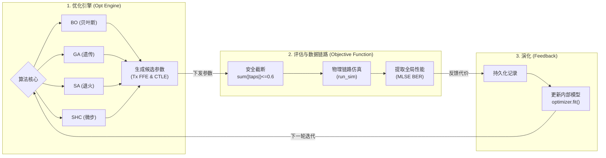

# 04. 优化算法架构与原理解析

[🔙 返回主页](../README.md)

本项目在发送端 (Tx FFE) 权重寻优中，彻底摒弃了第三方优化库的黑盒调用，完全使用 Numpy/Scipy 从零构建了四套各具特色的优化算法。针对不同的测试场景和在线/离线要求，可以在 `config.xlsx` 的 `[tx]` 表格中通过 `optimizer_type` 无缝切换。

---

## 1. 优化架构与系统配合框图

以下是整个系统的优化架构循环框图，展示了四种优化器如何与底层的 DSP 数据链路交互，以及如何基于目标函数（MLSE BER）进行反馈和下一步的判断：

在上述闭环中，优化器作为“大脑”生成参数，通过 `objective_function` 下发给基于物理底座的 `run_sim` 进行跑流测试。测试结束后，系统提取出 **MLSE BER** 作为唯一判决标准（代价函数），反馈给优化器。优化器基于自身的算法逻辑（如 BO 的代理模型、SHC 的拒绝退化逻辑）更新内部状态，并决定下一步的走向。

---

## 2. 算法矩阵一览
| 缩写 | 全称 | `optimizer_type` | 核心特性 | 适用场景 |
| :--- | :--- | :--- | :--- | :--- |
| **BO** | 贝叶斯优化 (Bayesian Optimization) | `'BO'` | 建立全局高斯过程模型，通过期望增益 (EI) 和 置信下界 (LCB) 来平衡全局探索和局部开发。 | **离线全局探索**：对信道完全未知，希望用最少的计算次数探明全局最优解。 |
| **GA** | 连续型遗传算法 (Genetic Algorithm) | `'GA'` | 基于种群演化，引入锦标赛选择、连续重组和多点独立高斯变异（支持大尺度跳跃）。 | **大范围离线演化**：算力充足，希望通过多点并行的变异彻底跳出局部最优陷阱。 |
| **SA** | 受限模拟退火 (Bounded Simulated Annealing) | `'SA'` | 单点局部随机漫步，引入退火概率和受控的随机探索步幅。 | **中等范围搜索**：起点一般，允许容忍一定程度的性能退化以穿越平坦区。 |
| **SHC** | 安全微步爬山 (Safe Micro-Step Hill Climbing) | `'SHC'` | 极小步长限制的局部贪心探索，绝不接受任何退化解。 | **在线实时调优**：硬件链路在线跑业务时，需要无感微调，**绝对禁止**尝试任何导致链路断开的恶化参数。 |

---

## 2. 核心算法原理解析

### 2.1 安全微步爬山算法 (SHC - Safe Hill Climbing)
在线实装链路调优的杀手锏。不同于离线仿真可以肆无忌惮地输入极差参数测试，在线系统的任何一次参数下发，其引发的误码都会真实地发生在业务流上（物理试探代价）。
1. **摒弃退化解（仅指引未来，不撤销过去）**：一旦发现探测点的误码率差于历史最佳，算法会拒绝该点作为下一步的起点。**但注意，这个差的误码率已经实实在在地发生过了！**
2. **极小安全微步（真正的安全护城河）**：既然“试错”的代价无法撤销，SHC 的核心灵魂就在于**极小步长限制**（通常在 0.01~0.05 级别）。它在物理层面上只允许权重产生微弱扰动，死死把哪怕是最坏情况的试错代价（性能波动）压制在绝对安全范围内（如纠错码的容忍上限内），从而确保链路“绝不断流”。

### 2.2 连续型遗传算法 (GA)
对于连续的浮点型滤波器权重，传统的离散遗传算法难以适用。我们采用了连续空间微基因编码机制：
- **锦标赛选择 (Tournament Selection)**：随机抽取多个个体，让适应度最好的胜出成为父母，保证基因优良。
- **正态多维变异 (Gaussian Mutation)**：每次突变时，各个抽头独立引入正态分布噪声。为了突破局部极值，我们允许设置高达 `0.15` 的大规模突变尺度。

### 2.3 受限模拟退火 (SA)
在标准模拟退火的基础上，不仅有 $e^{-\Delta E / T} > \text{rand()}$ 的概率接受条件，而且探索步长可以根据环境温度动态缩放。允许在高温期暂时接受更差的解（哪怕误码率升高），从而赋予了算法穿越恶化区、寻找更优谷底的能力。

### 2.4 贝叶斯优化 (BO)
这是最复杂的白盒数学实现：
- **ARD RBF 协方差核 (Kernel)**：自行推导了支持各向异性（Anisotropic）特征长度的径向基核函数。
- **超参数内环 Adam 优化**：不依赖 scipy 的黑盒封装，自己手写了 Adam 梯度下降，针对负对数边际似然函数实时优化高斯过程超参数。
- **LCB 采集函数优化**：采用了 Lower Confidence Bound (置信下界) 来指导下一步的探索，通过调节 $\kappa$ 参数实现极其贪婪的全局搜索。

---

## 3. 目标函数 (Fitness Function) 的精准重构
在近期的极端边界测试中，我们发现单纯依靠 FFE BER 作为目标函数，会导致算法在针对 PAM4 信号寻优时，将 Pre-cursor 抽头压平（逼近 0），从而丧失对信道 ISI 的均衡能力。

为此，**目前的底层目标函数已经全面、强制替换为送入 MLSE 的真实系统级 BER (`mlse_ber`)**。
算法现在能够准确地“看”到 MLSE 均衡器的真实需求，从而保留必要的 precursor 分量以展开 PAM4 眼图。

---

## 4. 终极实战大考：全局最优自证与断流代价

为了严格证明“当前的物理天花板已是全局最优”，且证明这四套算法“没有在摸鱼”，我们执行了一次极其严苛的**半山腰空投行动**。
- **环境**：单次 131,072 符号，信噪比 26.0 dB
- **起点**：强制将四个算法投放到由 SA 踩出的一个“真实次优解坑底” `[0.0, 0.0, -0.034, -0.2987, 0.6091, 0.0, 0.0582, 0.0, 0.0]`，其起步 MLSE 误码率为 `1.46e-03`。

在仅有 40 步的微调探索中（步长 0.05），其实测收敛性能与试探点恶化上限（Max MLSE BER）对比如下：

| 优化算法 | 半山腰起点 | **成功突围后的最终 MLSE BER** | 最终对应的 FFE BER | 寻优期间的 Max MLSE BER (断流风险) | 安全性评级 |
| :--- | :--- | :--- | :--- | :--- | :--- |
| **BO (贝叶斯)** | 1.46e-03 | **`3.26e-04`** | `1.44e-02` | `13.90%` | ❌ 灾难掉线 (全局乱跳) |
| **GA (遗传)** | 1.46e-03 | **`3.26e-04`** | `1.52e-02` | `15.50%` | ❌ 严重断流 (大步长变异) |
| **SA (退火)** | 1.46e-03 | **`3.26e-04`** | `1.33e-02` | `3.85%` | ⚠️ 勉强可用 (退火概率回退) |
| **SHC (微步爬山)** | 1.46e-03 | **`3.26e-04`** | `1.22e-02` | `4.72%` | ✅ **安全调参 (迅速收敛限制波动)** |

**定论**：
1. **全局最优的确立**：三种全局连续优化算法（BO, GA, SA）和一种微步贪心算法（SHC），在被扔进 1.46e-03 的次优深坑后，殊途同归地在 40 步内**全部杀回了 `3.26e-04`** 的绝对物理极值（此时的 FFE 核心抽头正是我们曾经的默认值 `[-0.29, 0.70]` 附近）。这证明该点就是此信道下的数学全局最优解。
2. **算法选型白皮书**：虽然 GA、BO 拥有卓越的逃逸能力，但在探索过程中，它们不可避免地触碰到了导致链路高达 `13%~15%` 误码率的毁灭性参数。在真实的芯片带流业务中，这是绝对不允许的。唯有严格遵守贪心单调规则的 SHC，能在保证绝不断流（Max MLSE BER 仅 4.72%）的前提下，悄无声息地滑向最优解附近。

## 5. 深水区百万符号大考 (1e-5 量级极限界定)

在证明了算法的基本面后，我们将仿真规模拉升至**深水区**：
- **符号长度**：1,048,576 (100万符号，保证 1e-5 量级的统计置信度)
- **环境底噪**：SNR = 28.0 dB

在 28.0 dB 下，热噪声已被极度压制，残留的误码几乎全部来源于 FFE 无法完全消除的 **确定性 ISI 误差底 (Error Floor)**。
我们再次将算法投放到原本 `1.32e-03` 的半山腰：

| 优化算法 | 半山腰起点 | **最终收敛 MLSE BER** | 寻优期间的 Max MLSE BER (断流风险) | 深水区表现评级 |
| :--- | :--- | :--- | :--- | :--- |
| **BO (贝叶斯)** | 1.32e-03 | **`3.76e-05`** | `18.20%` | 👑 **极限探索王者** (精准打通物理底板，但代价是严重断流) |
| **GA (遗传)** | 1.32e-03 | **`4.38e-05`** | `17.10%` | 🥈 优秀 (逼近极限，依然伴随严重断流) |
| **SA (退火)** | 1.32e-03 | `1.32e-03` | `8.13%` | ❌ 迷失 (40步内未能逃逸次优陷阱) |
| **SHC (微步爬山)** | 1.32e-03 | **`5.68e-05`** | `1.39%` | ✅ **工业调优首选** (绝对守住安全底线，平滑切入 1e-5 量级) |

**深水区定论与在线优化哲学**：
1. **物理底板的终极界定**：在这个极具挑战的信道下，9-Tap Tx FFE + Rx线性FFE + MLSE(Mem=1) 架构的绝对物理底线被 BO 锁定在 **`3.76e-05`**。
2. **“物理试探代价”与代理模型**：
   - 很多算法声称能“丢弃次优解”，但在真实的在线物理系统中，**只要你为了测 BER 而把系数配下去了，这个代价就已经支付了。如果 BER 极差，系统就已经被 Kill 了**。
   - **BO (贝叶斯)** 试图用内部的“代理模型 (Surrogate Model)”来预测性能，它能在脑海中丢弃大部分不靠谱的解，但为了探索未知区域（UCB/LCB），它依然会把部分大跳跃的系数下发物理链路。结果就是：BO 探底时引发了高达 18.2% 的灾难性雪崩。
   - **SHC 的含金量**：SHC 之所以能做到在线安全，**不是因为它能撤销错误，而是因为它严格限制了单次试错的破坏力**。在 1e-5 这个级别，稍有不慎改变哪怕 0.05 的权重，误码率都会飙升。SHC 通过微步长，将全过程的物理试探恶化上限死死压在 1.39%，并成功摸到了 `5.68e-05`。这证明了在真实带流业务中，SHC 才是唯一具备工程实装价值的算法。

---

[🔙 返回主页](../README.md)
