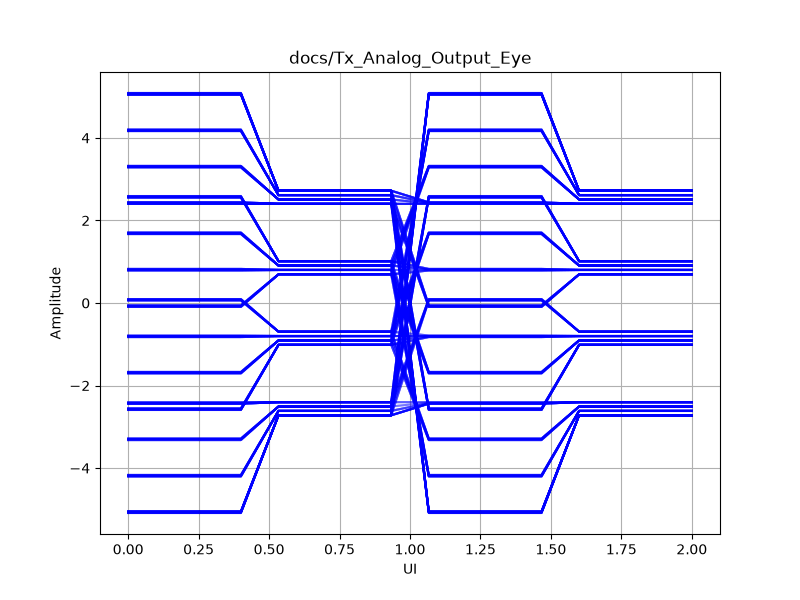
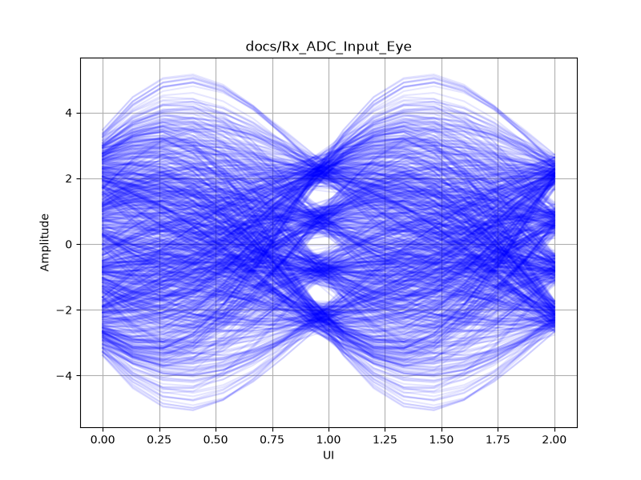

# LPO PAM4 (112G) V2 Test Report

## 1. Test Conditions
- **Architecture**: 
  - Tx DSP / DAC: 2 sps
  - Analog Channel (MZM, Fiber, PD, TIA): 8 sps
  - Rx DSP / ADC: 2 sps
- **Baud Rate**: 56.0 GBd
- **Channel Limits**: MZM (35GHz), PD (40GHz), TIA & ADC (35GHz)
- **Fiber Model**: 2.0 km length, 0.4 dB/km attenuation
- **Equalization**: Rx FFE (15 taps, T/2 spaced), MLSE (Memory=1)

## 2. Simulation Results

### 2.1 Eye Diagrams (Analog Domain @ 8 sps)
**DAC Output (Tx Analog Eye)**
This represents the signal immediately after the DAC Zero-Order Hold (before MZM):

**ADC Input (Rx Analog Eye)**
This represents the signal after the MZM, Fiber attenuation, PD, TIA, and analog low-pass filtering. Note the realistic high-frequency roll-off (ISI closure) and added electrical noise prior to DSP compensation.

### 2.2 DSP Performance Metrics
The system correctly identified a channel symbol delay of **2 symbols**. 
The Burg algorithm dynamically estimated an AR target coefficient of **`[0.1106]`**, which was fed into the Viterbi MLSE.

**BER Comparison:**
- **FFE Output (Slicer)**: 
  - SER: `1.25e-04`
  - BER: `6.25e-05`
- **MLSE Output**:
  - SER: `1.25e-04`
  - BER: `6.25e-05`

> **Note**: Because the FFE alone was able to converge well enough to open the eye (BER in the `1e-5` range, comfortably below KP4 FEC limits), the MLSE provided identical performance. For more severely degraded channels (e.g., 224G or longer fiber), the FFE BER will rise significantly, and the MLSE gain will become strictly necessary.
