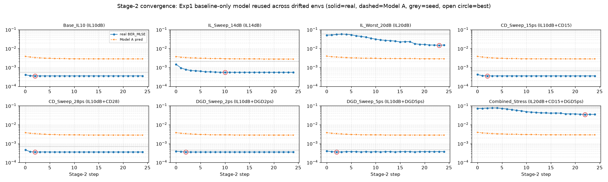
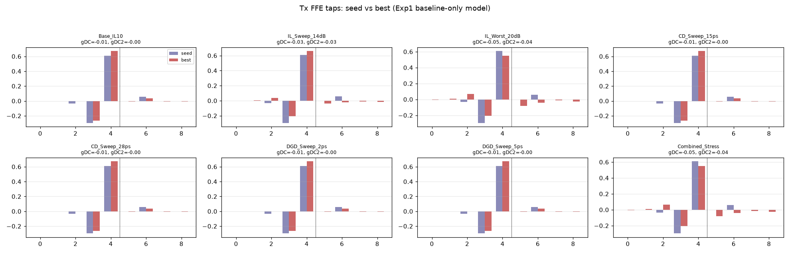
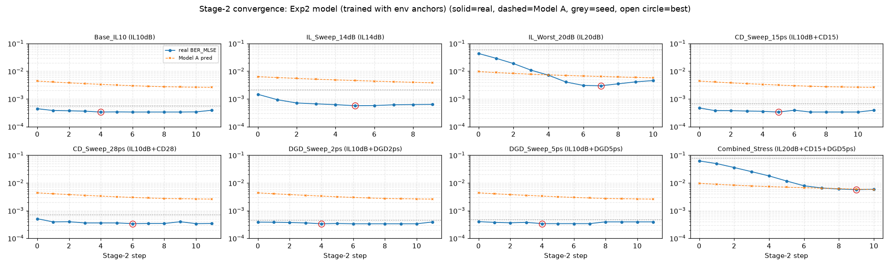
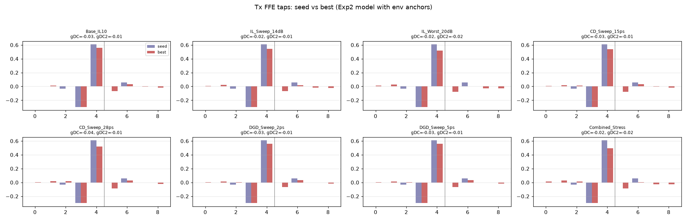
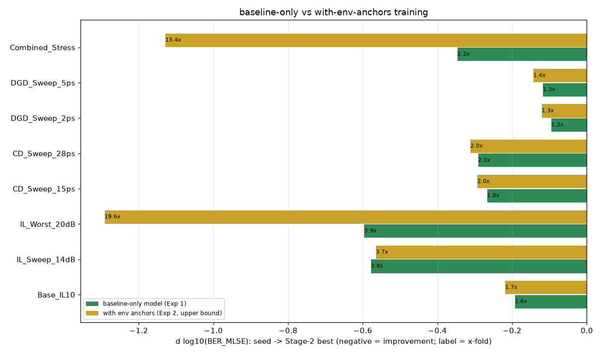

# DDPS v2：只用基线训练跨环境泛化 & 带锚点训练（BER_MLSE）

两个实验共用同一套评估：Rx 22-tap LMS FFE（无 DFE）→ MLSE（memory=1，Burg 白化），指标为 BER_MLSE；每点 131072 符号、固定随机种子；种子 x0 相同；Stage-2 只依据代理模型，真实 BER 仅记录不参与决策。

## 两个实验怎么切（差异只有训练数据）

| 实验 | 训练数据 | 模型 | 测试 | 定位 |
| --- | --- | --- | --- | --- |
| **实验一：只用基线训练 → 跨环境泛化** | 321 行 = 总 csv 过滤 `env==Base_IL10`（10dB 插损、CD/DGD=0 邻域 320 + 种子 1）—— 8 个测试环境的数据从未进训练集 | [`models/ddps_v2_control/`](../models/ddps_v2_control/) | 同一模型冻结，8 个漂移环境逐个 Stage-2，零重训/零校准 | 真·泛化（本页重点） |
| **实验二：带锚点训练（上限参考）** | 748 行 = Base_IL10 320 + 其余 7 环境各 60 + 每环境种子 1（含少量目标环境邻域样本） | [`models/ddps_v2/`](../models/ddps_v2/) | 单模型冻结、测试零重训 | 校准式上界，非严格泛化（模型见过测试环境） |

两实验仅训练集构成不同；模型结构/超参、种子 x0、8 个测试用例与评估协议完全相同。实验一回答“单点模型能否直接泛化”，实验二回答“允许少量目标环境标定数据能再提升多少”。下面两个实验的表与图都在本文件内。

## 实验1：只用基线训练 → 跨环境泛化（核心）

*训练只含 Base_IL10（10dB），测试环境完全未见*

| 用例（环境） | 种子 BER_MLSE | Stage-2 最优 (step) | Δlog10 | 改善× | 深水复核最优 (262144 sym) |
| --- | --- | --- | --- | --- | --- |
| Base_IL10 (IL10dB) | `5.53e-04` | `3.55e-04` (step 2) | `-0.19` | ×1.6 | `1.78e-04` |
| IL_Sweep_14dB (IL14dB) | `2.08e-03` | `5.49e-04` (step 10) | `-0.58` | ×3.8 | `2.76e-04` |
| IL_Worst_20dB (IL20dB) | `5.82e-02` | `1.47e-02` (step 23) | `-0.60` | ×3.9 | `1.58e-02` |
| CD_Sweep_15ps (IL10dB+CD15) | `6.57e-04` | `3.55e-04` (step 2) | `-0.27` | ×1.8 | `1.78e-04` |
| CD_Sweep_28ps (IL10dB+CD28) | `6.94e-04` | `3.55e-04` (step 2) | `-0.29` | ×2.0 | `1.80e-04` |
| DGD_Sweep_2ps (IL10dB+DGD2ps) | `4.42e-04` | `3.55e-04` (step 2) | `-0.09` | ×1.2 | `1.73e-04` |
| DGD_Sweep_5ps (IL10dB+DGD5ps) | `4.71e-04` | `3.59e-04` (step 2) | `-0.12` | ×1.3 | `1.73e-04` |
| Combined_Stress (IL20dB+CD15+DGD5ps) | `7.72e-02` | `3.48e-02` (step 22) | `-0.35` | ×2.2 | `3.63e-02` |

> 收敛轨迹与 trace 记录在实验目录（见文末逐用例链接）；Stage-2 全程真实 BER_MLSE 未出现劣于种子的步。

## 实验2：带锚点训练（上限参考）

*训练含每个测试环境 60 点锚点，单模型冻结*

| 用例（环境） | 种子 BER_MLSE | Stage-2 最优 (step) | Δlog10 | 改善× | 深水复核最优 (262144 sym) |
| --- | --- | --- | --- | --- | --- |
| Base_IL10 (IL10dB) | `5.53e-04` | `3.35e-04` (step 4) | `-0.22` | ×1.7 | `1.65e-04` |
| IL_Sweep_14dB (IL14dB) | `2.08e-03` | `5.66e-04` (step 5) | `-0.56` | ×3.7 | `3.07e-04` |
| IL_Worst_20dB (IL20dB) | `5.82e-02` | `2.97e-03` (step 7) | `-1.29` | ×19.6 | `2.73e-03` |
| CD_Sweep_15ps (IL10dB+CD15) | `6.57e-04` | `3.35e-04` (step 5) | `-0.29` | ×2.0 | `1.67e-04` |
| CD_Sweep_28ps (IL10dB+CD28) | `6.94e-04` | `3.39e-04` (step 6) | `-0.31` | ×2.0 | `1.71e-04` |
| DGD_Sweep_2ps (IL10dB+DGD2ps) | `4.42e-04` | `3.35e-04` (step 4) | `-0.12` | ×1.3 | `1.67e-04` |
| DGD_Sweep_5ps (IL10dB+DGD5ps) | `4.71e-04` | `3.39e-04` (step 4) | `-0.14` | ×1.4 | `1.71e-04` |
| Combined_Stress (IL20dB+CD15+DGD5ps) | `7.72e-02` | `5.74e-03` (step 9) | `-1.13` | ×13.4 | `5.78e-03` |

> 收敛轨迹与 trace 记录在实验目录（见文末逐用例链接）；Stage-2 全程真实 BER_MLSE 未出现劣于种子的步。

## 两实验改善量对比（绿=只用基线，黄=带锚点）

| 用例 | 种子 | 只用基线最优 | 带锚点最优 | 锚点额外增益 |
| --- | --- | --- | --- | --- |
| Base_IL10 | `5.53e-04` | `3.55e-04` (×1.6) | `3.35e-04` (×1.7) | 再优 1.1× |
| IL_Sweep_14dB | `2.08e-03` | `5.49e-04` (×3.8) | `5.66e-04` (×3.7) | 再优 1.0× |
| IL_Worst_20dB | `5.82e-02` | `1.47e-02` (×3.9) | `2.97e-03` (×19.6) | 再优 5.0× |
| CD_Sweep_15ps | `6.57e-04` | `3.55e-04` (×1.8) | `3.35e-04` (×2.0) | 再优 1.1× |
| CD_Sweep_28ps | `6.94e-04` | `3.55e-04` (×2.0) | `3.39e-04` (×2.0) | 再优 1.0× |
| DGD_Sweep_2ps | `4.42e-04` | `3.55e-04` (×1.2) | `3.35e-04` (×1.3) | 再优 1.1× |
| DGD_Sweep_5ps | `4.71e-04` | `3.59e-04` (×1.3) | `3.39e-04` (×1.4) | 再优 1.1× |
| Combined_Stress | `7.72e-02` | `3.48e-02` (×2.2) | `5.74e-03` (×13.4) | 再优 6.1× |

解读：实验一（只用基线）8/8 用例均为正向优化（IL20 ×3.9、复合应力 ×2.2、IL10 族收敛到 ~3.4–3.6e-4），说明修复后的管线具备真实跨环境泛化能力；实验二在极端环境再优 5–6×（IL20 → 3.0e-3、复合 → 5.7e-3），但这是以把目标环境数据放进训练为代价的上界。

## 模型指标：实验一（只用基线）

- Model A（Tx FIR→log10 BER_MLSE，寻优方向）：R²=0.241，Spearman=0.497
- Model B（配置→log10 BER_MLSE，安全约束）：R²=0.186，Spearman=0.399
- meta：`models/ddps_v2_control/meta.json`

## 模型指标：实验二（带锚点）

- Model A（Tx FIR→log10 BER_MLSE，寻优方向）：R²=0.379，Spearman=0.649
- Model B（配置→log10 BER_MLSE，安全约束）：R²=0.242，Spearman=0.475
- meta：`models/ddps_v2/meta.json`

## 逐用例数据与节点图

| 用例 | 实验一（只用基线，核心） | 实验二（带锚点，上限） |
| --- | --- | --- |
| Base_IL10 | [收敛/抽头/CTLE/FIR](ddps_v2_control/report/ddps_v2_case_Base_IL10_a.png) · [眼图/频谱](ddps_v2_control/report/ddps_v2_case_Base_IL10_b.png) · [trace](ddps_v2_control/trace_Base_IL10.csv) | [图](ddps_v2_20260907/report/ddps_v2_case_Base_IL10_a.png) · [trace](ddps_v2_20260907/trace_Base_IL10.csv) |
| IL_Sweep_14dB | [收敛/抽头/CTLE/FIR](ddps_v2_control/report/ddps_v2_case_IL_Sweep_14dB_a.png) · [眼图/频谱](ddps_v2_control/report/ddps_v2_case_IL_Sweep_14dB_b.png) · [trace](ddps_v2_control/trace_IL_Sweep_14dB.csv) | [图](ddps_v2_20260907/report/ddps_v2_case_IL_Sweep_14dB_a.png) · [trace](ddps_v2_20260907/trace_IL_Sweep_14dB.csv) |
| IL_Worst_20dB | [收敛/抽头/CTLE/FIR](ddps_v2_control/report/ddps_v2_case_IL_Worst_20dB_a.png) · [眼图/频谱](ddps_v2_control/report/ddps_v2_case_IL_Worst_20dB_b.png) · [trace](ddps_v2_control/trace_IL_Worst_20dB.csv) | [图](ddps_v2_20260907/report/ddps_v2_case_IL_Worst_20dB_a.png) · [trace](ddps_v2_20260907/trace_IL_Worst_20dB.csv) |
| CD_Sweep_15ps | [收敛/抽头/CTLE/FIR](ddps_v2_control/report/ddps_v2_case_CD_Sweep_15ps_a.png) · [眼图/频谱](ddps_v2_control/report/ddps_v2_case_CD_Sweep_15ps_b.png) · [trace](ddps_v2_control/trace_CD_Sweep_15ps.csv) | [图](ddps_v2_20260907/report/ddps_v2_case_CD_Sweep_15ps_a.png) · [trace](ddps_v2_20260907/trace_CD_Sweep_15ps.csv) |
| CD_Sweep_28ps | [收敛/抽头/CTLE/FIR](ddps_v2_control/report/ddps_v2_case_CD_Sweep_28ps_a.png) · [眼图/频谱](ddps_v2_control/report/ddps_v2_case_CD_Sweep_28ps_b.png) · [trace](ddps_v2_control/trace_CD_Sweep_28ps.csv) | [图](ddps_v2_20260907/report/ddps_v2_case_CD_Sweep_28ps_a.png) · [trace](ddps_v2_20260907/trace_CD_Sweep_28ps.csv) |
| DGD_Sweep_2ps | [收敛/抽头/CTLE/FIR](ddps_v2_control/report/ddps_v2_case_DGD_Sweep_2ps_a.png) · [眼图/频谱](ddps_v2_control/report/ddps_v2_case_DGD_Sweep_2ps_b.png) · [trace](ddps_v2_control/trace_DGD_Sweep_2ps.csv) | [图](ddps_v2_20260907/report/ddps_v2_case_DGD_Sweep_2ps_a.png) · [trace](ddps_v2_20260907/trace_DGD_Sweep_2ps.csv) |
| DGD_Sweep_5ps | [收敛/抽头/CTLE/FIR](ddps_v2_control/report/ddps_v2_case_DGD_Sweep_5ps_a.png) · [眼图/频谱](ddps_v2_control/report/ddps_v2_case_DGD_Sweep_5ps_b.png) · [trace](ddps_v2_control/trace_DGD_Sweep_5ps.csv) | [图](ddps_v2_20260907/report/ddps_v2_case_DGD_Sweep_5ps_a.png) · [trace](ddps_v2_20260907/trace_DGD_Sweep_5ps.csv) |
| Combined_Stress | [收敛/抽头/CTLE/FIR](ddps_v2_control/report/ddps_v2_case_Combined_Stress_a.png) · [眼图/频谱](ddps_v2_control/report/ddps_v2_case_Combined_Stress_b.png) · [trace](ddps_v2_control/trace_Combined_Stress.csv) | [图](ddps_v2_20260907/report/ddps_v2_case_Combined_Stress_a.png) · [trace](ddps_v2_20260907/trace_Combined_Stress.csv) |

## 数据文件

- 总数据集：[`../dataset/ddps_v2_dataset_20260907_190819.csv`](../dataset/ddps_v2_dataset_20260907_190819.csv)（748 行：Base 321 + 7 环境锚点各 61）
- 实验一模型只用其中 `env==Base_IL10` 的 321 行；实验二模型用全部 748 行
- 实验一：case 汇总 [`case_summary.csv`](ddps_v2_control/case_summary.csv)、深水 [`deep_check.csv`](ddps_v2_control/report/deep_check.csv)
- 实验二：case 汇总 [`case_summary.csv`](ddps_v2_20260907/case_summary.csv)、深水 [`deep_check.csv`](ddps_v2_20260907/report/deep_check.csv)
- 逐级轨迹：两实验目录下 `trace_<用例>.csv`（每用例一个文件）

## 相关文档

- [`docs/06` DDPS v2 重做报告](../docs/06_DDPS_v2_Rerun.md)：v1 根因与修复清单
- [`docs/04` DDPS 架构](../docs/04_DDPS_Optimization.md) | [`docs/03` 排坑记录](../docs/03_Troubleshooting_History.md)
- v1 历史数据/模型/结果（本地目录，未入库）：`archive/20260904_ddps_v1_physical_pre_v2/`
