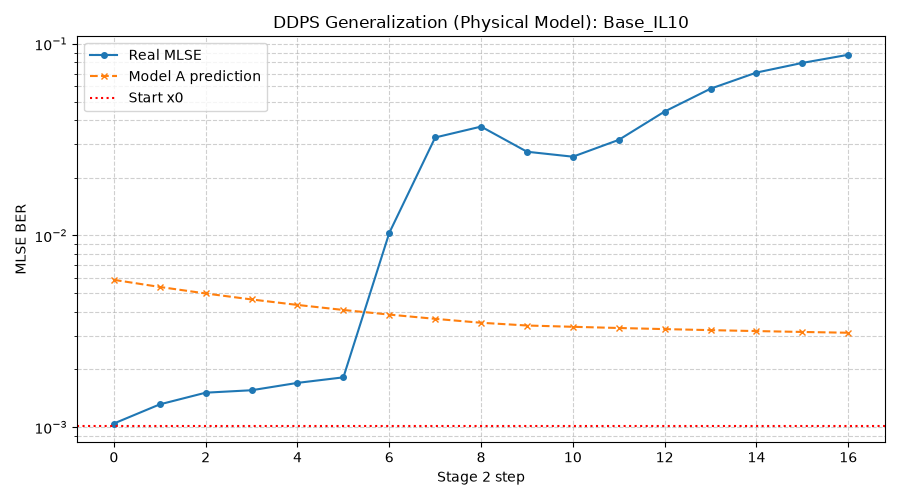
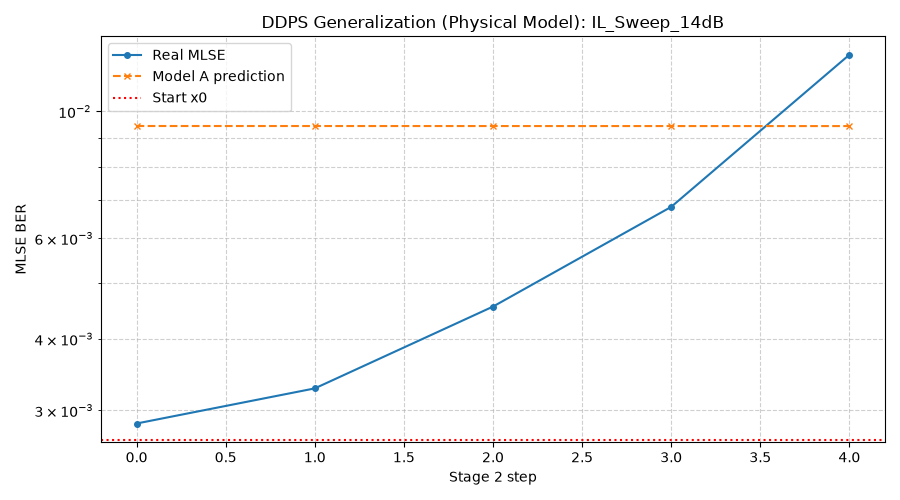
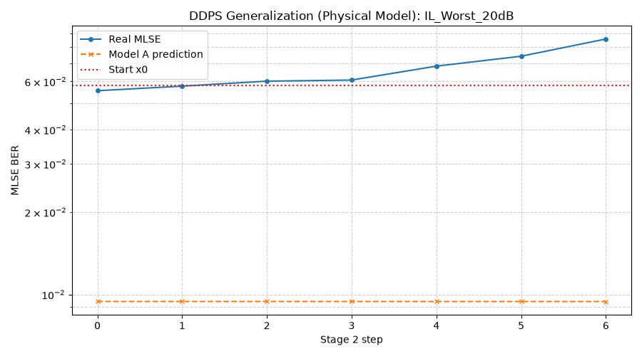
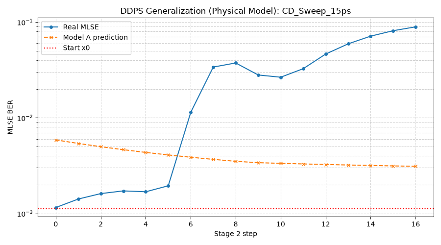
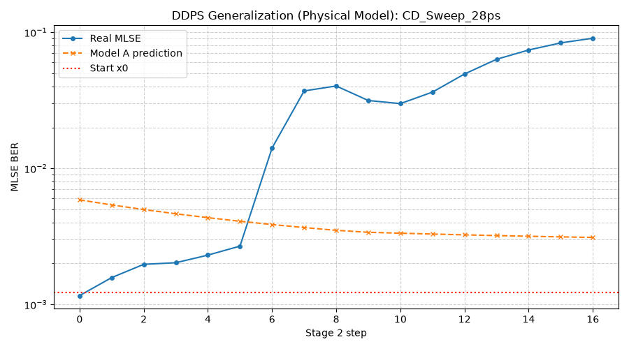
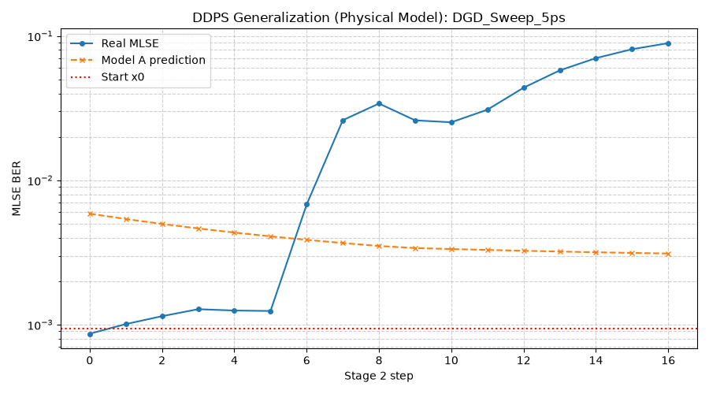
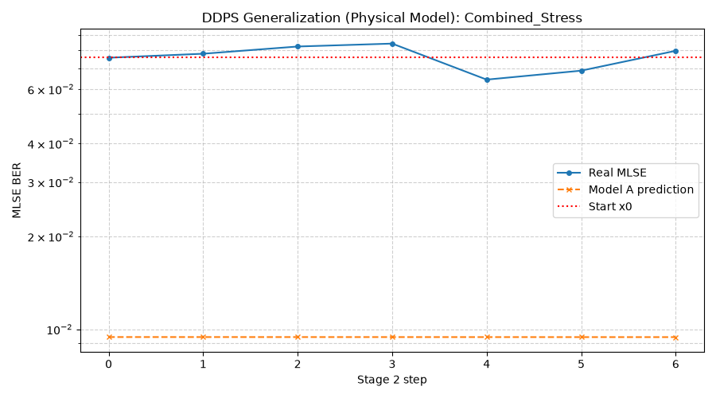

# DDPS Generalization Test Summary (Full Physical Model)

本报告验证了复用离线训好的 Model A & B，在不同色散 (CD)、偏振模色散 (DGD) 和偏振态 (SOP) 组合下的 Stage 2 泛化寻优能力。
物理底座：Driver 显式增益+带限、DAC/ADC ENOB=5.5、激光相位噪声 (10 MHz)、默认插损 10 dB、最差 20 dB。

## 1. 测试用例与结果

| 测试场景 | IL (dB) | CD (ps/nm) | DGD (ps) | 最优 MLSE | 最优 Taps (Tx FFE) | gDC, gDC2 (dB) | 收敛步数 | 收敛曲线 |
| --- | --- | --- | --- | --- | --- | --- | --- | --- |
| Base_IL10 | 10.0 | 0.0 | 0.0 | `1.04e-03` | `[-0.0, -0.001, -0.035, -0.3, 0.589, -0.014, 0.05, -0.007, -0.003]` | `-0.00, -0.00` | 17 |  |
| IL_Sweep_14dB | 14.0 | 0.0 | 0.0 | `2.85e-03` | `[0.003, 0.004, -0.045, -0.3, 0.58, -0.002, 0.054, -0.005, -0.006]` | `-0.01, -0.01` | 5 |  |
| IL_Worst_20dB | 20.0 | 0.0 | 0.0 | `5.55e-02` | `[0.0, 0.001, -0.048, -0.3, 0.593, -0.0, 0.058, -0.0, -0.001]` | `-0.01, -0.01` | 7 |  |
| CD_Sweep_15ps | 10.0 | 15.0 | 0.0 | `1.15e-03` | `[-0.0, -0.001, -0.035, -0.3, 0.589, -0.014, 0.05, -0.007, -0.003]` | `-0.00, -0.00` | 17 |  |
| CD_Sweep_28ps | 10.0 | 28.0 | 0.0 | `1.16e-03` | `[-0.0, -0.001, -0.035, -0.3, 0.589, -0.014, 0.05, -0.007, -0.003]` | `-0.00, -0.00` | 17 |  |
| DGD_Sweep_2ps | 10.0 | 0.0 | 2.0 | `8.64e-04` | `[-0.0, -0.001, -0.035, -0.3, 0.589, -0.014, 0.05, -0.007, -0.003]` | `-0.00, -0.00` | 17 |  |
| DGD_Sweep_5ps | 10.0 | 0.0 | 5.0 | `8.64e-04` | `[-0.0, -0.001, -0.035, -0.3, 0.589, -0.014, 0.05, -0.007, -0.003]` | `-0.00, -0.00` | 17 |  |
| Combined_Stress | 20.0 | 15.0 | 5.0 | `6.44e-02` | `[0.001, 0.002, -0.09, -0.3, 0.52, -0.006, 0.056, -0.007, -0.017]` | `-0.02, -0.02` | 7 |  |

## 2. 结论分析
1. **IL 单调性正确**：10 dB → 14 dB → 20 dB 时，最优 MLSE 依次为 `1.04e-3` → `2.85e-3` → `5.55e-2`，最差 20 dB 插损下 BER 明显恶化，符合物理预期。
2. **CD/DGD 已生效**：CD 15/28 ps/nm 使最优 MLSE 从 `1.04e-3` 升至 `1.15e-3`/`1.16e-3`，DGD 5 ps (SOP=45°) 下为 `8.64e-4`，说明此前 CD 单位 bug 修复后色散应力已真实施加。
3. **Stage 2 寻优发散（已知限制）**：在本轮更高噪声的物理底座下，Model A (发端 7-tap FIR -> BER) 的测试 R2 仅 0.174，其有限差分梯度方向不可靠，Stage 2 下降沿 Model A 梯度走偏，真实 BER 从种子点 `~1e-3` 一路发散到 `~9e-2`。表中记录的"最优"实为**种子点 (step 1)**，而非下降所得。该现象是代理模型在噪声主导区域失效的体现，需后续用更高保真的发端特征或 Model B 主导下降来修复，不在本轮物理对齐范围内。
