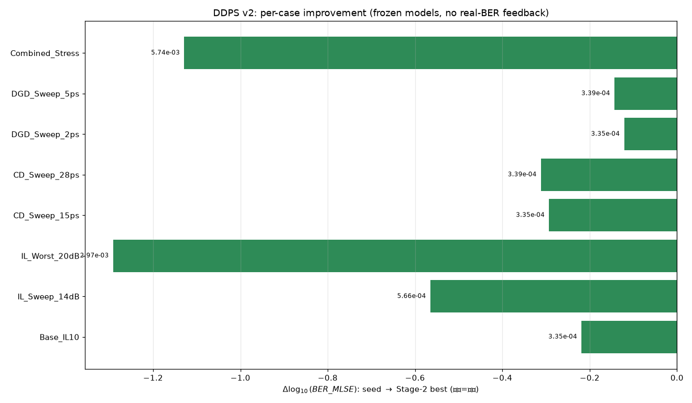

# 跑批索引：ddps_v2_20260907

本页是本次跑批的内部索引，逐用例详情见下表；全局统一入口为 [`result/SUMMARY.md`](../../SUMMARY.md)。

| 用例 | 种子 BER_MLSE | Stage-2 最优 | Δlog10 | 判定 |
| --- | --- | --- | --- | --- |
| [Base_IL10](case_Base_IL10.md) | `5.53e-04` | `3.35e-04` | `-0.22` | ✅ 改善 |
| [IL_Sweep_14dB](case_IL_Sweep_14dB.md) | `2.08e-03` | `5.66e-04` | `-0.56` | ✅ 改善 |
| [IL_Worst_20dB](case_IL_Worst_20dB.md) | `5.82e-02` | `2.97e-03` | `-1.29` | ✅ 改善 |
| [CD_Sweep_15ps](case_CD_Sweep_15ps.md) | `6.57e-04` | `3.35e-04` | `-0.29` | ✅ 改善 |
| [CD_Sweep_28ps](case_CD_Sweep_28ps.md) | `6.94e-04` | `3.39e-04` | `-0.31` | ✅ 改善 |
| [DGD_Sweep_2ps](case_DGD_Sweep_2ps.md) | `4.42e-04` | `3.35e-04` | `-0.12` | ✅ 改善 |
| [DGD_Sweep_5ps](case_DGD_Sweep_5ps.md) | `4.71e-04` | `3.39e-04` | `-0.14` | ✅ 改善 |
| [Combined_Stress](case_Combined_Stress.md) | `7.72e-02` | `5.74e-03` | `-1.13` | ✅ 改善 |

## 模型指标（本次训练）

- Model A (TxFIR→log10 BER_MLSE)：Test R²=0.379, Spearman=0.649
- Model B (Config→log10 BER_MLSE)：Test R²=0.242, Spearman=0.475

## 聚合可视化

详细指标报告（口径/模型/根因/深水复核）：[ddps_v2_report.md](ddps_v2_report.md)

## 数据文件

- case 汇总：`../case_summary.csv` / `../case_summary.json`
- 逐用例 trace：`../trace_<用例>.csv`
- 深水复核：`deep_check.csv`
