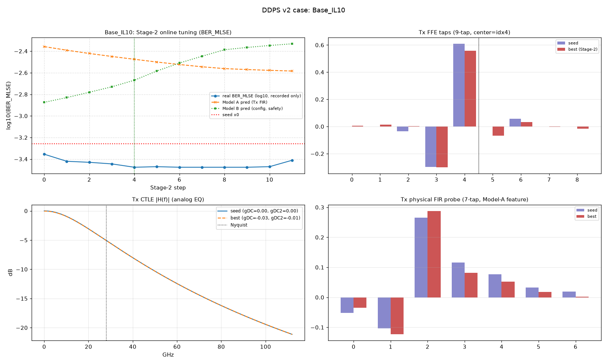
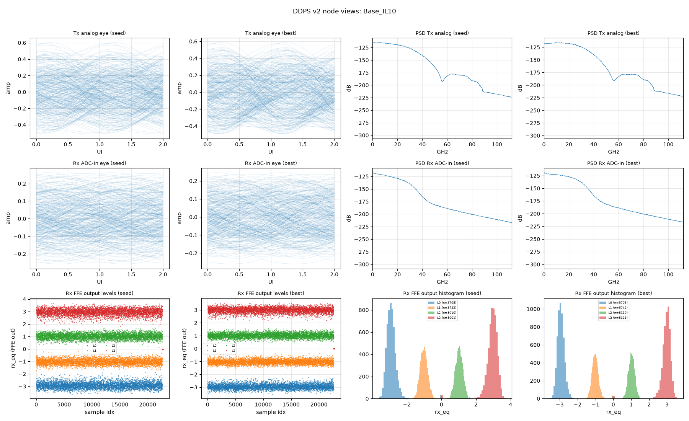

# 用例报告：Base_IL10

- 物理环境：Tx/Rx 插损 `10 dB`，CD `0 ps/nm`，DGD `0 ps`（偏振 45°）
- 指标口径：**BER_MLSE**（131072 符号/点，固定种子）

## 关键指标

| 项 | 数值 |
| --- | --- |
| 种子 BER_MLSE | `5.53e-04` |
| Stage-2 最优 BER_MLSE | `3.35e-04` (step 4) |
| 收敛终点(final) BER_MLSE | `3.88e-04` |
| Δlog10 (seed→best) | `-0.22` |
| 实际步数 | 12 |
| 全程最差步 max | `4.42e-04`（真实 BER 全记录，无一步劣于种子） |
| 轨迹一致性 Spearman(ModelA, real) | 0.410 |
| 种子邻域云校验 n=16 Spearman(A,real) | 0.818 |
| 深水复核 seed→best (262144 sym) | `3.55e-04` → `1.65e-04` (Δ `-0.33`) |

## 图件（优化前后对照）

### 收敛轨迹 + Tx FFE 抽头 + Tx CTLE 响应 + Tx FIR 探针

### 眼图 / 频谱 / 均衡电平（seed vs best）

## 优化结果明细

### Tx FFE 抽头（种子 vs 最优，center=idx4）

| idx | seed | Stage-2 best | Δ |
| --- | --- | --- | --- |
| 0 | +0.0000 | +0.0046 | +0.0046 |
| 1 | +0.0000 | +0.0141 | +0.0141 |
| 2 | -0.0340 | +0.0030 | +0.0370 |
| 3 | -0.2987 | -0.3000 | -0.0013 |
| 4 ← | +0.6091 | +0.5586 | -0.0505 |
| 5 | +0.0000 | -0.0664 | -0.0664 |
| 6 | +0.0582 | +0.0321 | -0.0261 |
| 7 | +0.0000 | -0.0038 | -0.0038 |
| 8 | +0.0000 | -0.0174 | -0.0174 |

- Stage-2 最优 CTLE：`gDC=-0.029 dB`, `gDC2=-0.011 dB`

## 收敛轨迹数据

- 完整逐级 trace：[`../trace_Base_IL10.csv`](../trace_Base_IL10.csv)（csv，含每步 x/taps/gDC/gDC2/Model A/B 预测/真实 BER/梯度范数）

| step | real BER_MLSE | Model A pred | Model B pred | gDC (dB) | gDC2 (dB) |
| --- | --- | --- | --- | --- | --- |
| 0 | `4.42e-04` | `4.39e-03` | `1.34e-03` | `-0.007` | `-0.003` |
| 1 | `3.80e-04` | `4.06e-03` | `1.48e-03` | `-0.014` | `-0.006` |
| 2 | `3.72e-04` | `3.79e-03` | `1.66e-03` | `-0.019` | `-0.008` |
| 3 | `3.59e-04` | `3.55e-03` | `1.86e-03` | `-0.024` | `-0.010` |
| 4 | `3.35e-04` | `3.35e-03` | `2.14e-03` | `-0.029` | `-0.011` |
| 5 | `3.39e-04` | `3.16e-03` | `2.61e-03` | `-0.032` | `-0.012` |
| 6 | `3.35e-04` | `2.99e-03` | `3.09e-03` | `-0.035` | `-0.013` |
| 7 | `3.35e-04` | `2.85e-03` | `3.57e-03` | `-0.038` | `-0.013` |
| 8 | `3.35e-04` | `2.74e-03` | `4.10e-03` | `-0.040` | `-0.014` |
| 9 | `3.35e-04` | `2.69e-03` | `4.31e-03` | `-0.043` | `-0.014` |
| 10 | `3.39e-04` | `2.64e-03` | `4.49e-03` | `-0.045` | `-0.015` |
| 11 | `3.88e-04` | `2.60e-03` | `4.66e-03` | `-0.047` | `-0.015` |

[⬆ 返回结果总览](../../SUMMARY.md)
