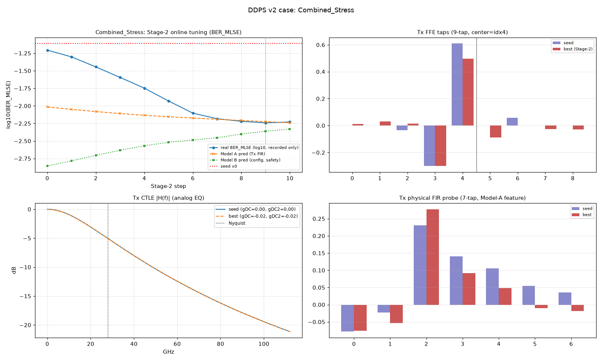
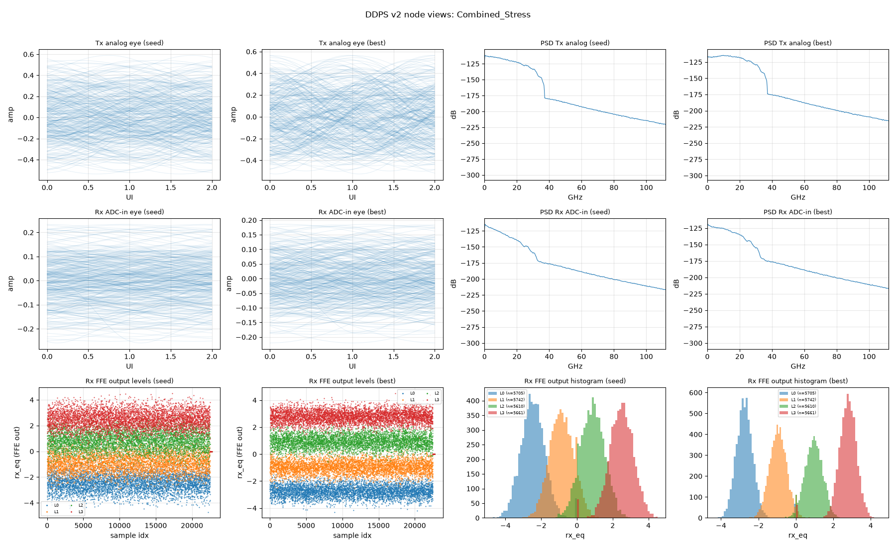

# 用例报告：Combined_Stress

- 物理环境：Tx/Rx 插损 `20 dB`，CD `15 ps/nm`，DGD `5 ps`（偏振 45°）
- 指标口径：**BER_MLSE**（131072 符号/点，固定种子）

## 关键指标

| 项 | 数值 |
| --- | --- |
| 种子 BER_MLSE | `7.72e-02` |
| Stage-2 最优 BER_MLSE | `5.74e-03` (step 9) |
| 收敛终点(final) BER_MLSE | `5.90e-03` |
| Δlog10 (seed→best) | `-1.13` |
| 实际步数 | 11 |
| 全程最差步 max | `6.22e-02`（真实 BER 全记录，无一步劣于种子） |
| 轨迹一致性 Spearman(ModelA, real) | 0.991 |
| 种子邻域云校验 n=16 Spearman(A,real) | 0.550 |
| 深水复核 seed→best (262144 sym) | `7.76e-02` → `5.78e-03` (Δ `-1.13`) |

## 图件（优化前后对照）

### 收敛轨迹 + Tx FFE 抽头 + Tx CTLE 响应 + Tx FIR 探针

### 眼图 / 频谱 / 均衡电平（seed vs best）

## 优化结果明细

### Tx FFE 抽头（种子 vs 最优，center=idx4）

| idx | seed | Stage-2 best | Δ |
| --- | --- | --- | --- |
| 0 | +0.0000 | +0.0121 | +0.0121 |
| 1 | +0.0000 | +0.0304 | +0.0304 |
| 2 | -0.0340 | +0.0155 | +0.0495 |
| 3 | -0.2987 | -0.3000 | -0.0013 |
| 4 ← | +0.6091 | +0.4962 | -0.1129 |
| 5 | +0.0000 | -0.0890 | -0.0890 |
| 6 | +0.0582 | +0.0021 | -0.0561 |
| 7 | +0.0000 | -0.0259 | -0.0259 |
| 8 | +0.0000 | -0.0289 | -0.0289 |

- Stage-2 最优 CTLE：`gDC=-0.019 dB`, `gDC2=-0.015 dB`

## 收敛轨迹数据

- 完整逐级 trace：[`../trace_Combined_Stress.csv`](../trace_Combined_Stress.csv)（csv，含每步 x/taps/gDC/gDC2/Model A/B 预测/真实 BER/梯度范数）

| step | real BER_MLSE | Model A pred | Model B pred | gDC (dB) | gDC2 (dB) |
| --- | --- | --- | --- | --- | --- |
| 0 | `6.22e-02` | `9.66e-03` | `1.39e-03` | `-0.004` | `-0.004` |
| 1 | `4.98e-02` | `8.92e-03` | `1.65e-03` | `-0.007` | `-0.007` |
| 2 | `3.59e-02` | `8.30e-03` | `1.97e-03` | `-0.010` | `-0.010` |
| 3 | `2.54e-02` | `7.78e-03` | `2.33e-03` | `-0.012` | `-0.012` |
| 4 | `1.79e-02` | `7.35e-03` | `2.70e-03` | `-0.014` | `-0.013` |
| 5 | `1.17e-02` | `7.00e-03` | `3.03e-03` | `-0.015` | `-0.014` |
| 6 | `7.88e-03` | `6.71e-03` | `3.27e-03` | `-0.017` | `-0.015` |
| 7 | `6.57e-03` | `6.44e-03` | `3.51e-03` | `-0.018` | `-0.015` |
| 8 | `6.02e-03` | `6.19e-03` | `3.97e-03` | `-0.019` | `-0.015` |
| 9 | `5.74e-03` | `5.96e-03` | `4.35e-03` | `-0.019` | `-0.015` |
| 10 | `5.90e-03` | `5.75e-03` | `4.67e-03` | `-0.020` | `-0.015` |

[⬆ 返回结果总览](../../SUMMARY.md)
