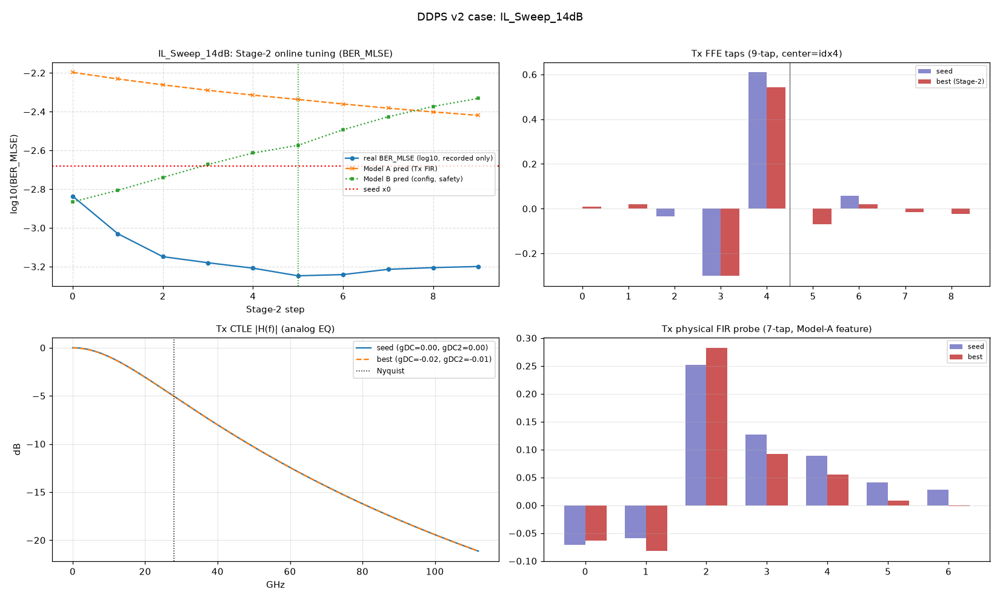
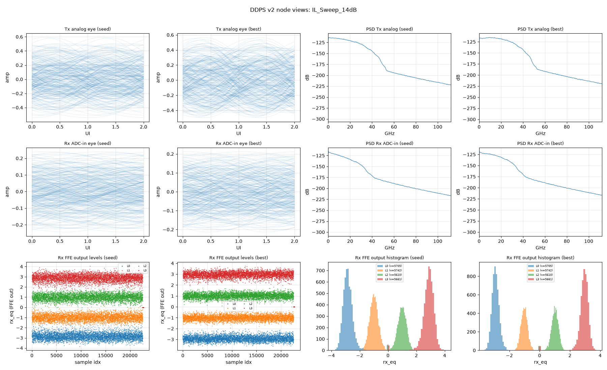

# 用例报告：IL_Sweep_14dB

- 物理环境：Tx/Rx 插损 `14 dB`，CD `0 ps/nm`，DGD `0 ps`（偏振 45°）
- 指标口径：**BER_MLSE**（131072 符号/点，固定种子）

## 关键指标

| 项 | 数值 |
| --- | --- |
| 种子 BER_MLSE | `2.08e-03` |
| Stage-2 最优 BER_MLSE | `5.66e-04` (step 5) |
| 收敛终点(final) BER_MLSE | `6.32e-04` |
| Δlog10 (seed→best) | `-0.56` |
| 实际步数 | 10 |
| 全程最差步 max | `1.46e-03`（真实 BER 全记录，无一步劣于种子） |
| 轨迹一致性 Spearman(ModelA, real) | 0.648 |
| 种子邻域云校验 n=16 Spearman(A,real) | 0.826 |
| 深水复核 seed→best (262144 sym) | `1.82e-03` → `3.07e-04` (Δ `-0.77`) |

## 图件（优化前后对照）

### 收敛轨迹 + Tx FFE 抽头 + Tx CTLE 响应 + Tx FIR 探针

### 眼图 / 频谱 / 均衡电平（seed vs best）

## 优化结果明细

### Tx FFE 抽头（种子 vs 最优，center=idx4）

| idx | seed | Stage-2 best | Δ |
| --- | --- | --- | --- |
| 0 | +0.0000 | +0.0089 | +0.0089 |
| 1 | +0.0000 | +0.0211 | +0.0211 |
| 2 | -0.0340 | +0.0002 | +0.0342 |
| 3 | -0.2987 | -0.3000 | -0.0013 |
| 4 ← | +0.6091 | +0.5415 | -0.0676 |
| 5 | +0.0000 | -0.0695 | -0.0695 |
| 6 | +0.0582 | +0.0196 | -0.0386 |
| 7 | +0.0000 | -0.0154 | -0.0154 |
| 8 | +0.0000 | -0.0239 | -0.0239 |

- Stage-2 最优 CTLE：`gDC=-0.016 dB`, `gDC2=-0.012 dB`

## 收敛轨迹数据

- 完整逐级 trace：[`../trace_IL_Sweep_14dB.csv`](../trace_IL_Sweep_14dB.csv)（csv，含每步 x/taps/gDC/gDC2/Model A/B 预测/真实 BER/梯度范数）

| step | real BER_MLSE | Model A pred | Model B pred | gDC (dB) | gDC2 (dB) |
| --- | --- | --- | --- | --- | --- |
| 0 | `1.46e-03` | `6.35e-03` | `1.36e-03` | `-0.004` | `-0.004` |
| 1 | `9.33e-04` | `5.87e-03` | `1.56e-03` | `-0.008` | `-0.006` |
| 2 | `7.10e-04` | `5.47e-03` | `1.82e-03` | `-0.010` | `-0.008` |
| 3 | `6.61e-04` | `5.13e-03` | `2.12e-03` | `-0.013` | `-0.010` |
| 4 | `6.19e-04` | `4.85e-03` | `2.43e-03` | `-0.015` | `-0.011` |
| 5 | `5.66e-04` | `4.60e-03` | `2.67e-03` | `-0.016` | `-0.012` |
| 6 | `5.74e-04` | `4.36e-03` | `3.21e-03` | `-0.017` | `-0.013` |
| 7 | `6.11e-04` | `4.15e-03` | `3.75e-03` | `-0.018` | `-0.013` |
| 8 | `6.24e-04` | `3.97e-03` | `4.24e-03` | `-0.019` | `-0.013` |
| 9 | `6.32e-04` | `3.81e-03` | `4.66e-03` | `-0.019` | `-0.013` |

[⬆ 返回结果总览](../../SUMMARY.md)
