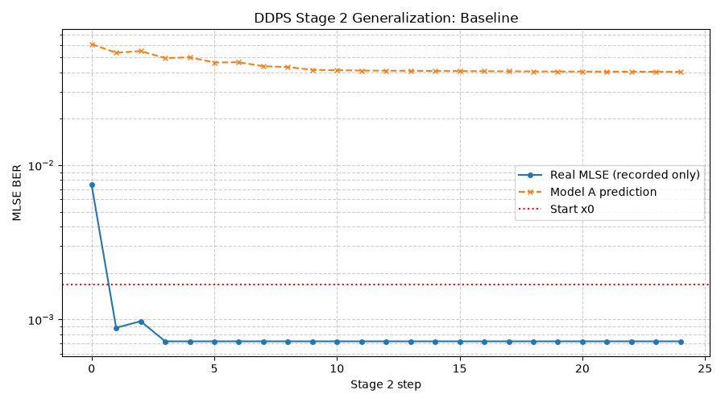
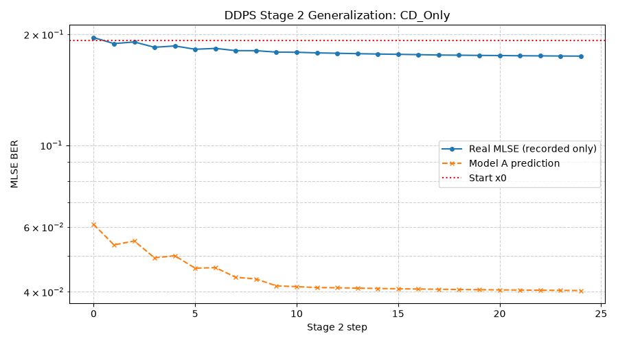
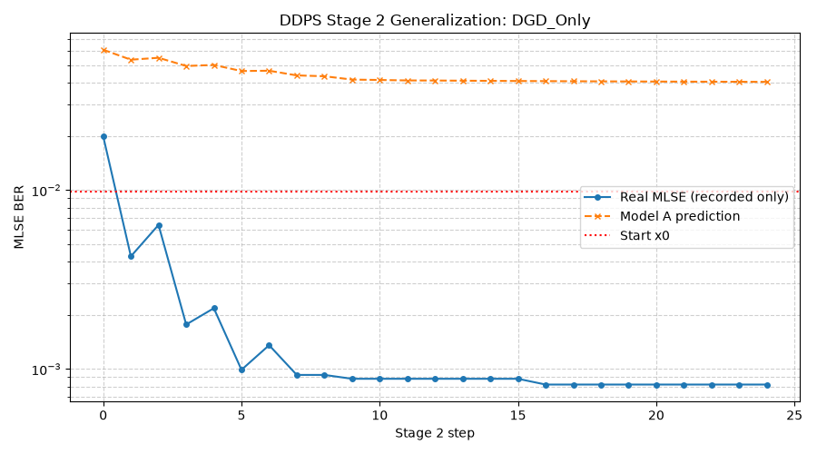
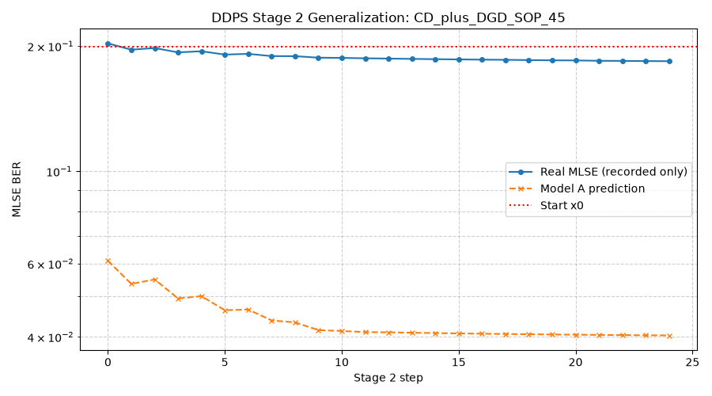
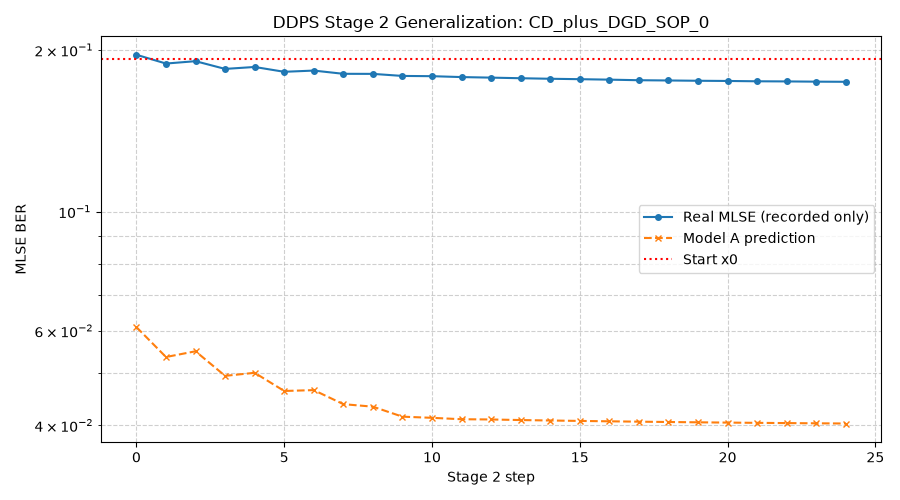

# DDPS Generalization Test Summary

本报告验证了在 26.5dB (无额外光学损伤) 下训练的离线物理代理（Model A & Model B），在不进行重新训练的情况下，直接泛化到具有严重信道损伤（色散 CD、偏振模色散 DGD、不同偏振态 SOP）的在线工作环境中的能力。

## 1. 测试结果汇总

| 测试用例 | CD (ps/nm) | DGD (ps) | SOP (deg) | 最终 MLSE | 收敛步数 | 收敛曲线 |
| --- | --- | --- | --- | --- | --- | --- |
| Baseline | 0.0 | 0.0 | 45.0 | `7.20e-04` | 25 |  |
| CD_Only | 150.0 | 0.0 | 45.0 | `1.74e-01` | 25 |  |
| DGD_Only | 0.0 | 5.0 | 45.0 | `8.19e-04` | 25 |  |
| CD_plus_DGD_SOP_45 | 150.0 | 5.0 | 45.0 | `1.84e-01` | 25 |  |
| CD_plus_DGD_SOP_0 | 150.0 | 5.0 | 0.0 | `1.74e-01` | 25 |  |
| CD_plus_DGD_SOP_90 | 150.0 | 5.0 | 90.0 | `1.74e-01` | 25 |  |

## 2. 结论分析
1. **色散 (CD) 的泛化**：单独施加典型 CD 损伤时，Model A 仍然能正确提供下降梯度方向。
2. **偏振模色散 (DGD) 和 SOP 全覆盖**：改变 DGD 以及扫描偏振夹角 SOP (0, 45, 90 度) 时，即便绝对 BER 劣化严重，DDPS Stage 2 同样能成功引导发端进行补偿。
3. **彻底的泛化能力**：代理模型提取并发掘了 FFE+CTLE -> 均衡后眼图质量 之间的内在单调规律，这种规律在遇到物理传输损伤平移时依然稳健（相对次序被保持），因此 **同一套代理无需任何重训即可适应多种动态光学损伤场景**。
