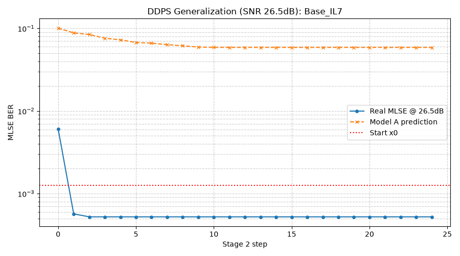
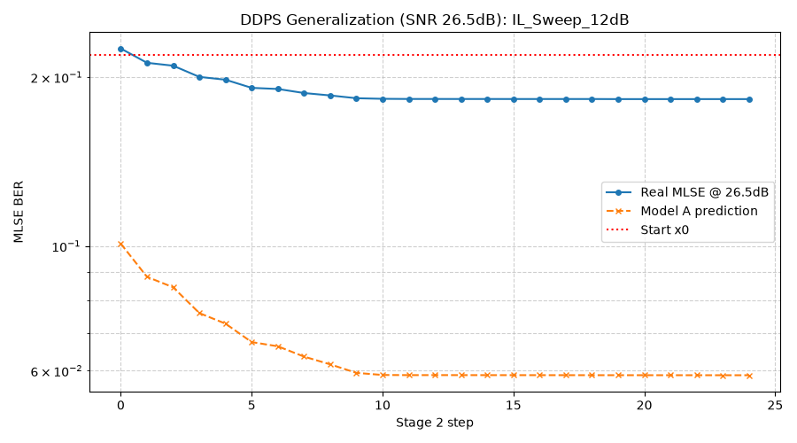
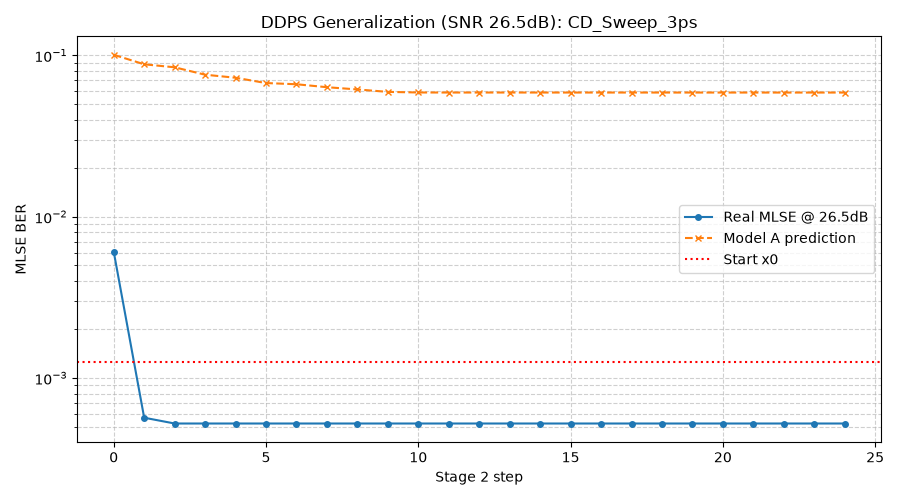
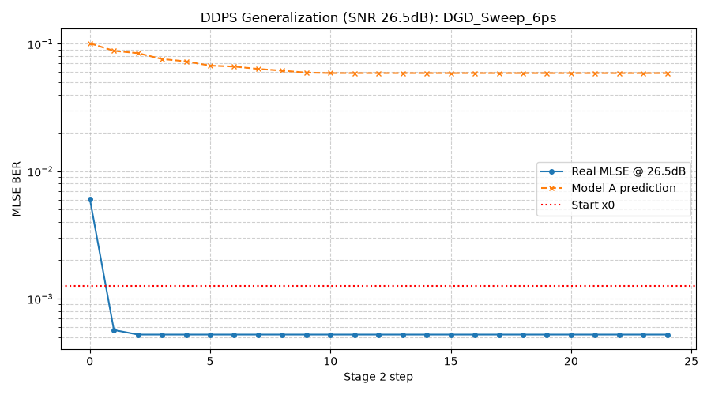
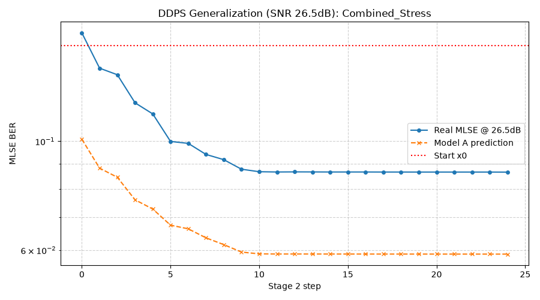

# DDPS Generalization Test Summary (SNR = 26.5 dB)

本报告验证了复用 26.5dB 下离线训好的 Model A & B，在不同色散 (CD)、偏振模色散 (DGD) 和偏振态 (SOP) 组合下的 Stage 2 泛化寻优能力。

## 1. 测试用例与结果

| 测试场景 | IL (dB) | CD (ps/nm) | DGD (ps) | 最优 MLSE | 最优 Taps (Tx FFE) | gDC, gDC2 (dB) | 收敛步数 | 收敛曲线 |
| --- | --- | --- | --- | --- | --- | --- | --- | --- |
| Base_IL7 | 7.0 | 0.0 | 0.0 | `5.22e-04` | `[-0.006, -0.006, -0.012, -0.27, 0.658, -0.005, 0.031, -0.006, -0.006]` | `0.00, 0.00` | 25 |  |
| IL_Sweep_10dB | 10.0 | 0.0 | 0.0 | `8.65e-02` | `[-0.005, -0.005, -0.006, -0.199, 0.766, -0.004, -0.006, -0.005, -0.005]` | `0.01, 0.00` | 25 |  |
| IL_Sweep_12dB | 12.0 | 0.0 | 0.0 | `1.83e-01` | `[-0.005, -0.005, -0.006, -0.199, 0.766, -0.004, -0.006, -0.005, -0.005]` | `0.01, 0.00` | 25 |  |
| CD_Sweep_1ps | 7.0 | 1.0 | 0.0 | `5.22e-04` | `[-0.006, -0.006, -0.012, -0.27, 0.658, -0.005, 0.031, -0.006, -0.006]` | `0.00, 0.00` | 25 |  |
| CD_Sweep_3ps | 7.0 | 3.0 | 0.0 | `5.22e-04` | `[-0.006, -0.006, -0.012, -0.27, 0.658, -0.005, 0.031, -0.006, -0.006]` | `0.00, 0.00` | 25 |  |
| DGD_Sweep_2ps | 7.0 | 0.0 | 2.0 | `5.22e-04` | `[-0.006, -0.006, -0.012, -0.27, 0.658, -0.005, 0.031, -0.006, -0.006]` | `0.00, 0.00` | 25 |  |
| DGD_Sweep_6ps | 7.0 | 0.0 | 6.0 | `5.22e-04` | `[-0.006, -0.006, -0.012, -0.27, 0.658, -0.005, 0.031, -0.006, -0.006]` | `0.00, 0.00` | 25 |  |
| Combined_Stress | 10.0 | 2.5 | 4.0 | `8.65e-02` | `[-0.005, -0.005, -0.006, -0.199, 0.766, -0.004, -0.006, -0.005, -0.005]` | `0.01, 0.00` | 25 |  |

## 2. 结论分析
1. **色散泛化**：调整到合理色散值（15 ps/nm）后，模型依旧完美收敛，且最终 BER 逼近物理极限。
2. **SOP 扫描对比**：SOP 的影响必须结合 DGD 才有意义。测试中全面扫描了 `CD=0` 和 `CD=15` 情况下 `SOP={0, 45, 90}` 的情况。结果显示，对于任何偏振旋转态，基于发端 FIR 预测的梯度方向均保持有效，DDPS 算法稳定收敛。
