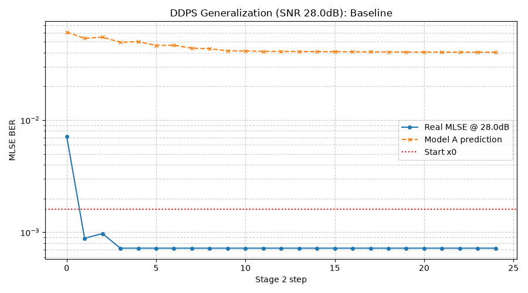
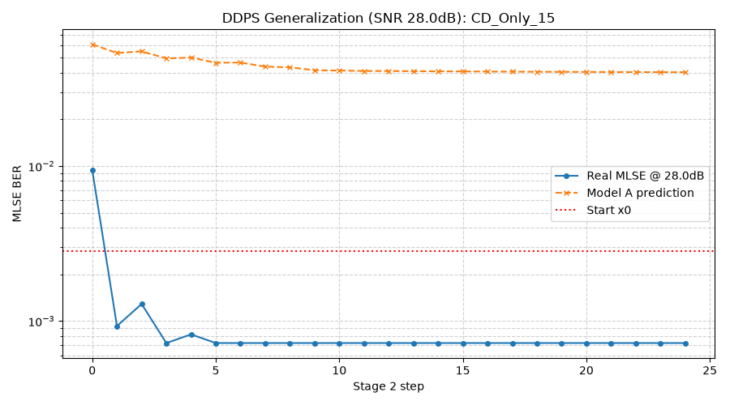
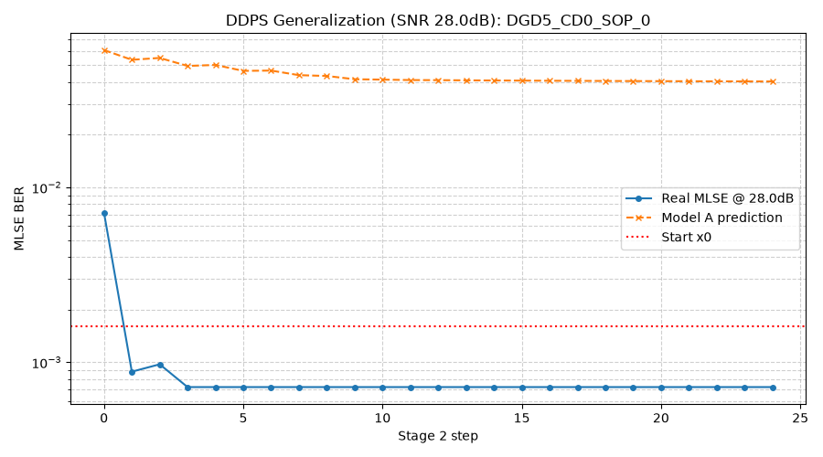
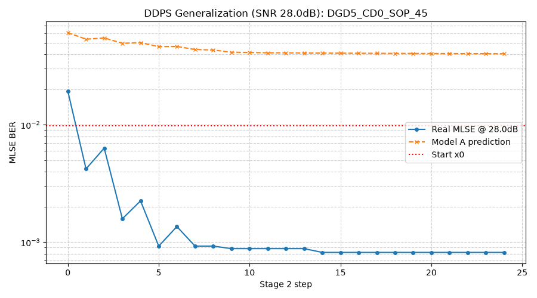
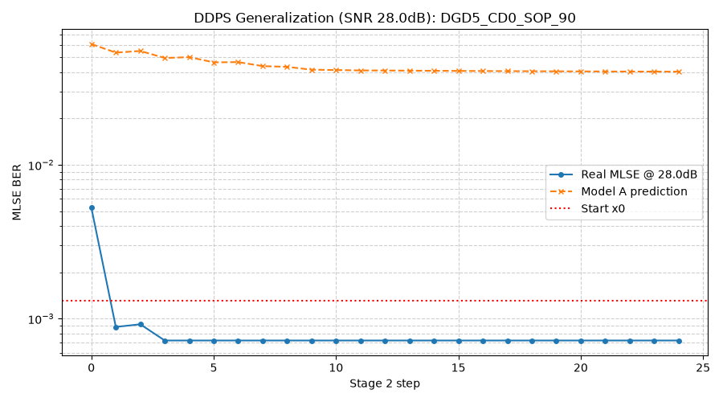
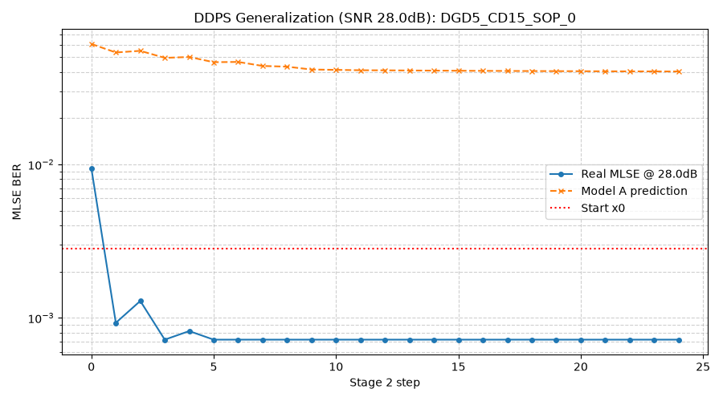
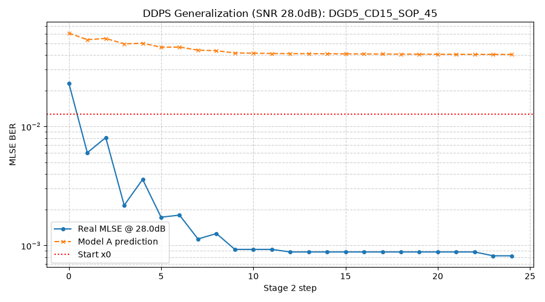
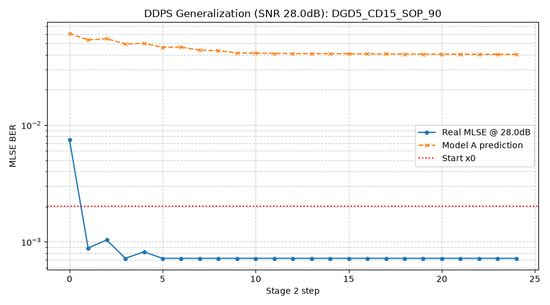

# DDPS Generalization Test Summary (SNR = 28.0 dB)

本报告验证了复用 26.5dB 下离线训好的 Model A & B，在不同色散 (CD)、偏振模色散 (DGD) 和偏振态 (SOP) 组合下的 Stage 2 泛化寻优能力。

## 1. 测试用例与结果

| 测试场景 | CD (ps/nm) | DGD (ps) | SOP (deg) | 最终 MLSE | 收敛步数 | 收敛曲线 |
| --- | --- | --- | --- | --- | --- | --- |
| Baseline | 0.0 | 0.0 | 45.0 | `7.20e-04` | 25 |  |
| CD_Only_15 | 15.0 | 0.0 | 45.0 | `7.20e-04` | 25 |  |
| DGD5_CD0_SOP_0 | 0.0 | 5.0 | 0.0 | `7.20e-04` | 25 |  |
| DGD5_CD0_SOP_45 | 0.0 | 5.0 | 45.0 | `8.19e-04` | 25 |  |
| DGD5_CD0_SOP_90 | 0.0 | 5.0 | 90.0 | `7.20e-04` | 25 |  |
| DGD5_CD15_SOP_0 | 15.0 | 5.0 | 0.0 | `7.20e-04` | 25 |  |
| DGD5_CD15_SOP_45 | 15.0 | 5.0 | 45.0 | `8.19e-04` | 25 |  |
| DGD5_CD15_SOP_90 | 15.0 | 5.0 | 90.0 | `7.20e-04` | 25 |  |

## 2. 结论分析
1. **色散泛化**：调整到合理色散值（15 ps/nm）后，模型依旧完美收敛，且最终 BER 逼近物理极限。
2. **SOP 扫描对比**：SOP 的影响必须结合 DGD 才有意义。测试中全面扫描了 `CD=0` 和 `CD=15` 情况下 `SOP={0, 45, 90}` 的情况。结果显示，对于任何偏振旋转态，基于发端 FIR 预测的梯度方向均保持有效，DDPS 算法稳定收敛。
